> **文档元信息**
>
> | 项目 | 内容 |
> |------|------|
> | 文档版本 | v1.0 |
> | 作者 | DTCoder（系分生成阶段自动产出） |
> | 创建日期 | 2026-07-30 |
> | 需求来源 | iMoney-H5/docs/superpowers/specs/2026-07-30-algorithm-demo-and-analytics-design.md（需求澄清产物） + 用户原始需求描述 |
> | 评审状态 | 待评审 |

# 算法演示与调用分析 系分设计

## 1. 需求与范围

### 背景与目标

提供一套「算法演示 + 调用分析」演示能力：后端用 Java 实现三个算法接口（HelloWorld、哈希算法、冒泡排序），前端（iMoney-H5 移动 H5）新增页面以三 Tab 展示各算法执行结果，并提供导出按钮一键导出各 Tab 结果为 Excel；后端对每次调用做埋点，记录调用次数与调用人，并在前端同页可视化报表中按人员类型/人员层级/人员部门等维度，以折线图、饼图、柱状图展示调用情况。

### 核心功能

- Java 后端三算法接口：HelloWorld、哈希算法（MD5/SHA-1/SHA-256）、冒泡排序（含排序过程 steps 快照）。
- 导出接口：导出各页面展示结果为 Excel .xlsx（多 Sheet，每 Tab 一 Sheet）。
- 后端埋点：记录调用次数、调用人、人员维度（类型/层级/部门）、调用时间、耗时、状态。
- 前端页面：三 Tab 展示不同执行结果；冒泡排序额外可视化 steps。
- 前端导出按钮：触发导出接口下载 xlsx。
- 前端可视化报表：折线图（日趋势）+ 饼图（维度占比）+ 柱状图（维度对比），支持维度切换（人员类型/人员层级/人员部门）与时间筛选（默认近 7 日）。

### 约束与非功能要求

- 后端语言/框架：Java + Spring Boot（用户原始需求明确"用 java"，系分阶段修正需求澄清产物中 Python+FastAPI 的假设）。
- 前端框架：UmiJS 4（`@umijs/max`）+ antd-mobile 5，移动 H5（postcss-px-to-viewport，viewportWidth 375）。
- 图表库：复用 iMoney-H5 已有依赖 `ant-design-mobile-chart`（^1.2.2），不引入桌面端 `@ant-design/charts`。
- 接口契约向后兼容：沿用需求澄清产物冻结的路径，实现语言改为 Java；响应结构统一为 `{code, msg, data, traceId}`（在原 `{code, data, traceId}` 基础上新增 `msg` 字段，向后兼容）。
- 演示用存储：SQLite（埋点 call_log 表），编码阶段可按部署环境切换为 MySQL。
- 调用人身份：请求头 `X-User-Id` / `X-User-Name`。
- 埋点写入异步，不阻塞主流程。

### 排除范围

- 不涉及真实组织架构数据对接（人员维度由后端回填 Mock 数据，待后续对接）。
- 不涉及用户登录/鉴权体系（演示用 Header 传身份）。
- 不涉及 iMoney / ArmBasic / PH2498.github.io 静态博客原有功能改动。

### 需求功能清单与优先级

| 编号 | 功能点 | 优先级 | PRD 原始描述/章节 | 备注 |
|------|--------|--------|-------------------|------|
| F01 | HelloWorld 接口（Java） | P0 | "用java分别写三个接口helloworld" | GET，返回固定文案 |
| F02 | 哈希算法接口（Java） | P0 | "哈希算法" | POST，支持 MD5/SHA-1/SHA-256 |
| F03 | 冒泡排序接口（Java） | P0 | "冒泡排序" | POST，返回排序结果 + steps 过程快照 |
| F04 | 导出接口（Java） | P0 | "新增导出按钮，后台提供导出接口，支持导出各个页面的展示结果" | POST，Excel xlsx 多 Sheet |
| F05 | 后端埋点 | P0 | "后端再做个埋点，获取调用次数和调用人" | 异步写 call_log |
| F06 | 前端三 Tab 页面 | P0 | "前端新增一个页面，有三个tab分别展示不同的执行结果" | iMoney-H5 src/pages/algorithm-demo |
| F07 | 前端导出按钮 | P0 | "新增导出按钮" | 触发 F04 下载 |
| F08 | 前端可视化报表 | P0 | "前端在当前页面上可视化出来一个报表查看调用情况（根据不同的维度：人员类型、人员层级、人员部门等），折线图以及饼图和柱状图不同展示形式" | ant-design-mobile-chart |
| F09 | 埋点查询接口（Java） | P0 | 支撑 F08 报表数据源 | GET，按维度 + 时间范围聚合 |
| F10 | 冒泡排序 steps 前端可视化 | P1 | "展示不同的执行结果" | 前端逐帧/高亮展示排序过程 |

### 假设与待确认项

| 编号 | 假设/待确认内容 | 当前假设 | 确认状态 |
|------|-----------------|----------|----------|
| A01 | 后端技术栈 | Java + Spring Boot（用户需求明确"用 java"） | 已确认 |
| A02 | 图表库选型 | 复用 iMoney-H5 已有 `ant-design-mobile-chart` ^1.2.2，不引入 `@ant-design/charts` | 已确认 |
| A03 | 埋点存储 | SQLite 演示用，编码阶段可切换 MySQL | 待确认 |
| A04 | 人员维度数据源 | 后端回填 Mock（人员类型/层级/部门），待后续对接组织数据 | 待确认 |
| A05 | 导出格式 | Excel .xlsx 多 Sheet，每 Tab 一 Sheet | 已确认 |
| A06 | 调用人身份传递 | 请求头 X-User-Id / X-User-Name | 已确认 |
| A07 | 报表时间范围 | 默认近 7 日，支持筛选 | 已确认 |
| A08 | 响应结构统一 | `{code, msg, data, traceId}`，在原契约上新增 msg（向后兼容） | 待确认 |
| A09 | 后端落盘仓库 | PH2498.github.io `server/` 子目录（Java Spring Boot） | 已确认 |
| A10 | 前端页面落盘 | iMoney-H5 `src/pages/algorithm-demo/`，路由 `/algorithm-demo` | 已确认 |

## 2. 架构与模块

### 功能架构

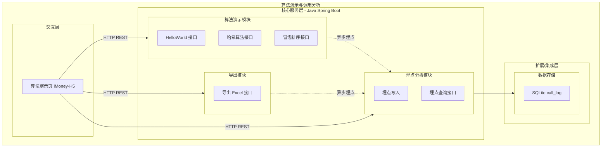

- 交互层说明：iMoney-H5 算法演示页，承载三 Tab、导出按钮、可视化报表。
- 核心服务层说明：Java Spring Boot 三模块——算法演示（三算法接口）、导出（Excel 多 Sheet）、埋点分析（写入 + 查询）。
- 扩展/集成层说明：SQLite 存储埋点 call_log 表。

**模块清单**

| 模块 | 职责 | 依赖 |
|------|------|------|
| 算法演示模块 | 提供 HelloWorld/哈希/冒泡排序三接口，计算并返回结果 | 埋点分析模块（异步） |
| 导出模块 | 按选定 Tab 导出 Excel xlsx 多 Sheet | 算法演示模块（复用计算） |
| 埋点分析模块 | 异步记录调用日志，按维度+时间聚合查询 | 数据存储（SQLite） |
| 前端算法演示页 | 三 Tab 展示、导出触发、可视化报表 | 后端三模块 REST 接口 |

### 应用集成架构

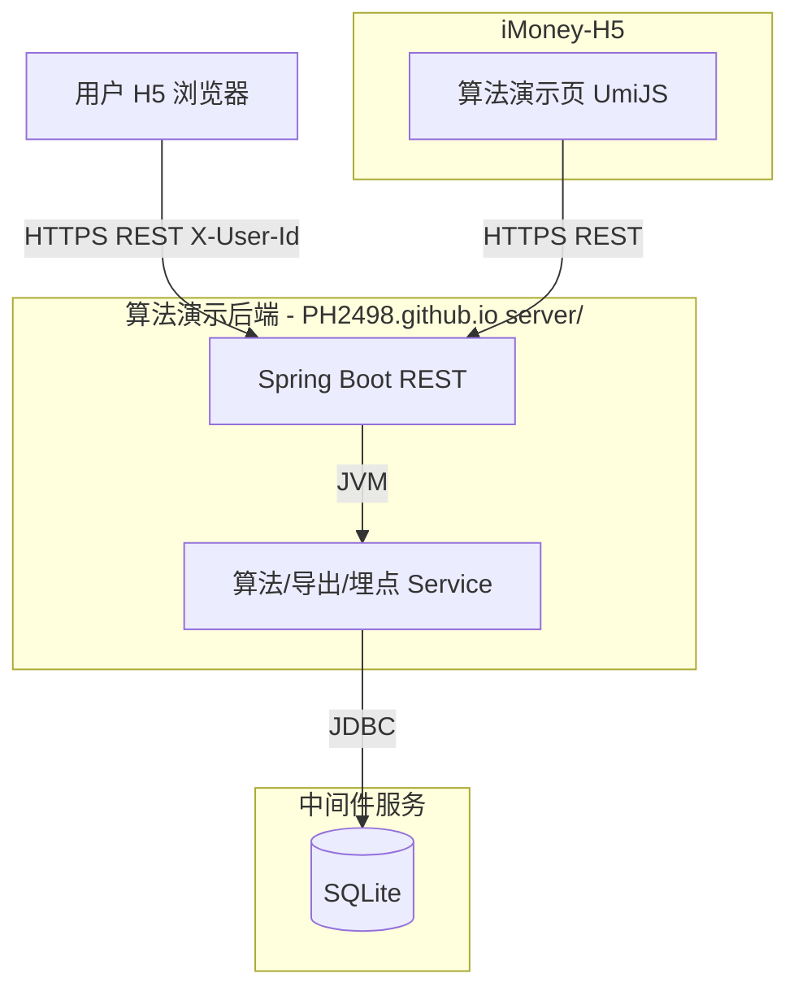

**集成关系说明：**

| 调用方 | 被调用方 | 协议 | 接口类型 | 说明 |
|--------|----------|------|----------|------|
| iMoney-H5 算法演示页 | 后端算法演示模块 | HTTPS | oneapi REST | 三算法接口调用 |
| iMoney-H5 算法演示页 | 后端导出模块 | HTTPS | oneapi REST（文件流） | 导出 xlsx |
| iMoney-H5 算法演示页 | 后端埋点分析模块 | HTTPS | oneapi REST | 报表数据查询 |
| 后端核心服务层 | SQLite | JDBC | SQL | call_log 读写 |

### 部署架构

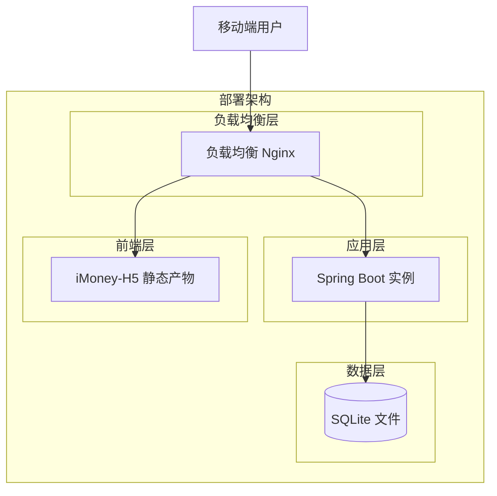

**部署说明：**
- **负载均衡层**：Nginx 转发，前端静态资源与后端 REST 反向代理分流。
- **应用层**：Spring Boot 单实例（演示），可水平扩展；埋点写 SQLite 文件。
- **数据层**：SQLite 单文件（演示），生产可切换 MySQL 主从。

## 3. 数据模型与存储

### 实体清单

| 实体名称 | 实体说明 | 所属模块 | 与其他实体的关系 |
|----------|----------|----------|-----------------|
| call_log | 接口调用埋点记录 | 埋点分析模块 | 无关联实体（独立日志表） |

### 实体关系图

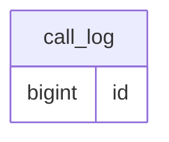

> call_log 为独立日志表，无与其他实体的外键关联。

**模型说明：**
- call_log 由后端各算法/导出接口处理时异步写入，记录调用次数、调用人、人员维度、耗时、状态。
- 人员维度字段（user_type / user_level / department）由后端在写入时回填，前端不采集。

## 4. 接口设计

### 4.1 oneapi（Web 控制台接口）

| 编号 | 接口名称 | 方法 | 路径 | 模块 |
|------|----------|------|------|------|
| W01 | HelloWorld | GET | /api/algorithm/helloworld | 算法演示模块 |
| W02 | 哈希算法 | POST | /api/algorithm/hash | 算法演示模块 |
| W03 | 冒泡排序 | POST | /api/algorithm/bubble-sort | 算法演示模块 |
| W04 | 导出 Excel | POST | /api/export | 导出模块 |
| W05 | 埋点查询 | GET | /api/analytics/calls | 埋点分析模块 |

### 4.2 OpenAPI（对外接口）

| 编号 | 接口名称 | 方法 | 路径 | 模块 |
|------|----------|------|------|------|
| - | 无对外 OpenAPI 接口（演示场景，仅 oneapi） | - | - | - |

### 4.3 内部接口（Service 层）

| 编号 | 接口名称 | 类 | 方法签名 |
|------|----------|------|----------|
| S01 | HelloWorld 执行 | AlgorithmService | `HelloWorldResultVO helloWorld()` |
| S02 | 哈希计算 | AlgorithmService | `HashResultVO hash(HashRequest req)` |
| S03 | 冒泡排序 | AlgorithmService | `BubbleSortResultVO bubbleSort(BubbleSortRequest req)` |
| S04 | 导出 Excel | ExportService | `byte[] export(List<String> tabs)` |
| S05 | 埋点写入（异步） | CallLogService | `void asyncRecord(CallLogDO log)` |
| S06 | 埋点聚合查询 | CallLogService | `AnalyticsResultVO query(String dimension, LocalDateTime start, LocalDateTime end)` |

### 4.4 集成接口（Integration 层）

| 编号 | 接口名称 | 类 | 方法签名 | 说明 |
|------|----------|------|----------|------|
| I01 | 人员维度回填 | UserDimensionProvider | `UserDimension get(String userId)` | 演示 Mock，待对接组织数据 |

## 5. 功能模块设计

### 5.1 算法演示模块

#### 5.1.1 表结构设计

本模块无独立表（埋点记录由埋点分析模块 call_log 承载）。

##### 5.1.1.x 枚举与常量定义

| 枚举名称 | 取值 | 含义 | 关联字段 |
|----------|------|------|----------|
| HashAlgorithm | MD5 | MD5 摘要算法 | HashRequest.algorithm |
| HashAlgorithm | SHA-1 | SHA-1 摘要算法 | HashRequest.algorithm |
| HashAlgorithm | SHA-256 | SHA-256 摘要算法（默认） | HashRequest.algorithm |

#### 5.1.2 接口详细设计

##### W01 HelloWorld

- **URI**: GET /api/algorithm/helloworld
- **描述**: 返回固定 HelloWorld 文案，演示最简接口。
- **入参**: 无（请求头携带 X-User-Id / X-User-Name）

- **出参**:

| 参数名称 | 类型 | 描述 |
|----------|------|------|
| code | Integer | 结果码，0 表示成功 |
| msg | String | 提示信息 |
| data | Object | 业务数据 |
| data.message | String | HelloWorld 文案 |
| traceId | String | 链路追踪 ID |

- **错误码**:

| 错误码 | 说明 |
|--------|------|
| ALG_001 | 服务内部异常 |

- **业务规则**: 固定返回 "Hello, World!"；异步埋点记录调用。

- **请求示例**:
```json
GET /api/algorithm/helloworld
Headers: X-User-Id: u001, X-User-Name: 张三
```

- **响应示例**:
```json
{
  "code": 0,
  "msg": "SUCCESS",
  "data": {
    "message": "Hello, World!"
  },
  "traceId": "a1b2c3d4"
}
```

##### W02 哈希算法

- **URI**: POST /api/algorithm/hash
- **描述**: 对输入字符串按指定算法计算哈希值。
- **入参**:

| 参数名称 | 类型 | 是否必填 | 描述 |
|----------|------|----------|------|
| input | String | 是 | 待哈希的原始字符串 |
| algorithm | String | 否 | MD5 / SHA-1 / SHA-256，默认 SHA-256 |

- **出参**:

| 参数名称 | 类型 | 描述 |
|----------|------|------|
| code | Integer | 结果码 |
| msg | String | 提示信息 |
| data.input | String | 原始输入 |
| data.algorithm | String | 实际使用算法 |
| data.hashValue | String | 哈希结果（十六进制） |
| traceId | String | 链路追踪 ID |

- **错误码**:

| 错误码 | 说明 |
|--------|------|
| ALG_002 | input 为空 |
| ALG_003 | algorithm 不支持 |

- **业务规则**: algorithm 校验白名单 MD5/SHA-1/SHA-256，非法返回 ALG_003；默认 SHA-256；异步埋点。

- **请求示例**:
```json
{
  "input": "hello",
  "algorithm": "SHA-256"
}
```

- **响应示例**:
```json
{
  "code": 0,
  "msg": "SUCCESS",
  "data": {
    "input": "hello",
    "algorithm": "SHA-256",
    "hashValue": "2cf24dba5fb0a30e26e83b2ac5b9e29e1b161e5c1fa7425e73043362938b9824"
  },
  "traceId": "a1b2c3d4"
}
```

##### W03 冒泡排序

- **URI**: POST /api/algorithm/bubble-sort
- **描述**: 对输入整数数组执行冒泡排序，返回结果及排序过程快照。
- **入参**:

| 参数名称 | 类型 | 是否必填 | 描述 |
|----------|------|----------|------|
| input | Integer[] | 是 | 待排序整数数组 |

- **出参**:

| 参数名称 | 类型 | 描述 |
|----------|------|------|
| code | Integer | 结果码 |
| msg | String | 提示信息 |
| data.input | Integer[] | 原始输入 |
| data.sorted | Integer[] | 排序结果 |
| data.steps | Object[] | 排序过程快照数组，供前端可视化 |
| data.steps[].pass | Integer | 第几趟 |
| data.steps[].swapped | Boolean | 本趟是否发生交换 |
| data.steps[].array | Integer[] | 本趟结束时的数组状态 |
| traceId | String | 链路追踪 ID |

- **错误码**:

| 错误码 | 说明 |
|--------|------|
| ALG_004 | input 为空或非整数数组 |
| ALG_005 | 数组长度超限（>1000） |

- **业务规则**: 数组长度上限 1000（防 OOM）；每趟记录快照；异步埋点。

- **请求示例**:
```json
{
  "input": [3, 1, 4, 1, 5]
}
```

- **响应示例**:
```json
{
  "code": 0,
  "msg": "SUCCESS",
  "data": {
    "input": [3, 1, 4, 1, 5],
    "sorted": [1, 1, 3, 4, 5],
    "steps": [
      {"pass": 1, "swapped": true, "array": [1, 3, 1, 4, 5]},
      {"pass": 2, "swapped": true, "array": [1, 1, 3, 4, 5]},
      {"pass": 3, "swapped": false, "array": [1, 1, 3, 4, 5]}
    ]
  },
  "traceId": "a1b2c3d4"
}
```

#### 5.1.3 子功能详细设计

##### 5.1.3.1 算法执行与埋点（F01/F02/F03）

- 处理时序图
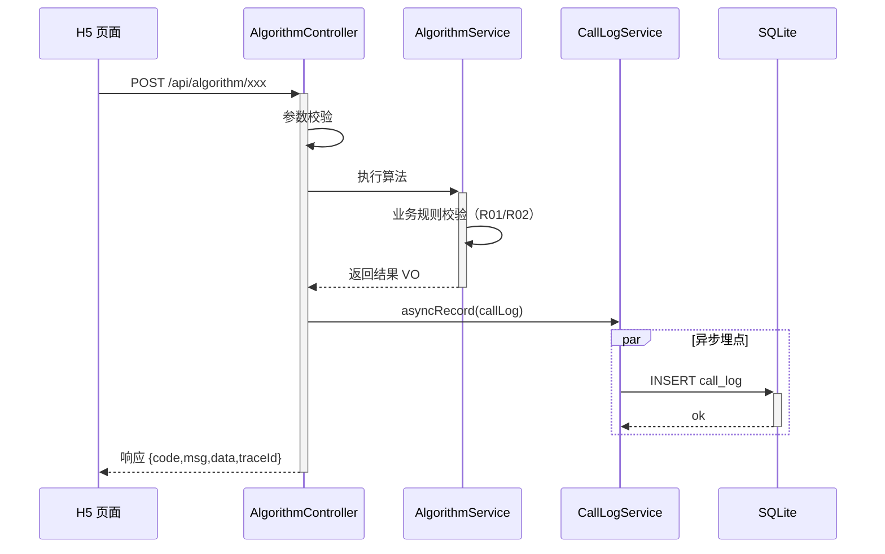

**业务规则：**
| 规则编号 | 规则描述 | 校验时机 | 不满足时的处理 |
|----------|----------|----------|--------------|
| R01 | input 非空 | 始终 | 返回 ALG_002/ALG_004 |
| R02 | algorithm 白名单 / 数组长度限制 | 始终 | 返回 ALG_003/ALG_005 |

**异常场景：**
| 异常场景 | 处理方式 |
|----------|----------|
| 哈希算法不支持 | 返回 ALG_003，提示"algorithm 不支持" |
| 数组超限 | 返回 ALG_005，提示"数组长度超限" |
| 埋点写入失败 | 仅记录日志，不影响主响应（异步降级） |

**并发控制（如涉及数据写入）：**
- 并发场景：算法接口为只读计算，无数据写入并发风险；埋点为追加写入日志，无冲突。
- 控制策略：无并发风险，原因：算法只读计算，埋点追加日志。

### 5.2 导出模块

#### 5.2.1 表结构设计

本模块无独立表。

##### 5.2.1.x 枚举与常量定义

| 枚举名称 | 取值 | 含义 | 关联字段 |
|----------|------|------|----------|
| ExportTab | helloworld | HelloWorld Tab | ExportRequest.tabs |
| ExportTab | hash | 哈希算法 Tab | ExportRequest.tabs |
| ExportTab | bubble-sort | 冒泡排序 Tab | ExportRequest.tabs |

#### 5.2.2 接口详细设计

##### W04 导出 Excel

- **URI**: POST /api/export
- **描述**: 按选定 Tab 导出各页面展示结果为 Excel xlsx，每 Tab 一 Sheet。
- **入参**:

| 参数名称 | 类型 | 是否必填 | 描述 |
|----------|------|----------|------|
| tabs | String[] | 否 | 选定 Tab 列表，默认全部三 Tab |

- **出参**:

| 参数名称 | 类型 | 描述 |
|----------|------|------|
| - | byte[]（文件流） | Content-Type: application/vnd.openxmlformats-officedocument.spreadsheetml.sheet |

- **错误码**:

| 错误码 | 说明 |
|--------|------|
| EXP_001 | 导出内部异常 |

- **业务规则**: 每个选定 Tab 对应一 Sheet；Sheet 内填该 Tab 最近一次结果（演示）；默认全部三 Tab；异步埋点。

- **请求示例**:
```json
{
  "tabs": ["helloworld", "hash", "bubble-sort"]
}
```

- **响应示例**:
```
HTTP 200
Content-Type: application/vnd.openxmlformats-officedocument.spreadsheetml.sheet
Content-Disposition: attachment; filename="algorithm-demo.xlsx"
<binary xlsx stream>
```

#### 5.2.3 子功能详细设计

##### 5.2.3.1 导出执行（F04/F07）

- 处理时序图
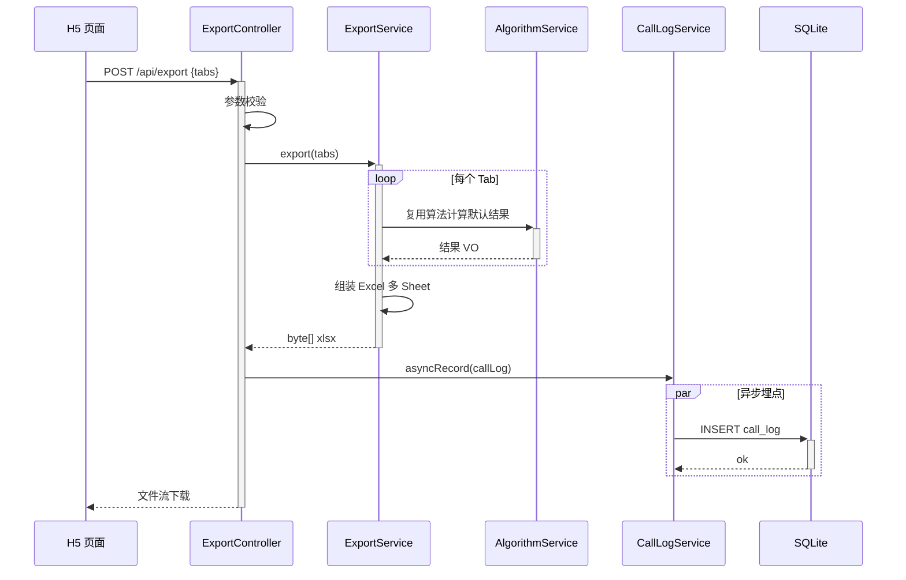

**业务规则：**
| 规则编号 | 规则描述 | 校验时机 | 不满足时的处理 |
|----------|----------|----------|--------------|
| R03 | tabs 为空时默认全部三 Tab | 始终 | 填充默认值 |
| R04 | tabs 元素须在白名单 | 始终 | 忽略非法元素，保留合法元素 |

**异常场景：**
| 异常场景 | 处理方式 |
|----------|----------|
| Excel 组装失败 | 返回 EXP_001 |
| 单个 Tab 计算失败 | 该 Sheet 填空表头 + 提示行，不中断整体导出 |

**并发控制（如涉及数据写入）：**
- 并发场景：导出为只读计算 + 文件流生成，无写入并发风险。
- 控制策略：无并发风险，原因：只读导出。

### 5.3 埋点分析模块

#### 5.3.1 表结构设计

##### 5.3.1.1 call_log

| 字段名 | 数据类型 | 约束 | 默认值 | 说明 |
|--------|----------|------|--------|------|
| id | bigint | PK, 自增 | - | 系统自增主键 |
| trace_id | varchar(64) | NOT NULL | - | 链路追踪 ID |
| api | varchar(64) | NOT NULL | - | 接口标识（helloworld/hash/bubble-sort/export） |
| caller_id | varchar(64) | NOT NULL | - | 调用人 ID（X-User-Id） |
| caller_name | varchar(64) | NOT NULL | - | 调用人姓名（X-User-Name） |
| user_type | varchar(32) | NOT NULL | - | 人员类型（后端回填） |
| user_level | varchar(32) | NOT NULL | - | 人员层级（后端回填） |
| department | varchar(64) | NOT NULL | - | 人员部门（后端回填） |
| call_time | datetime | NOT NULL | CURRENT_TIMESTAMP | 调用时间 |
| duration_ms | int | NOT NULL | 0 | 接口耗时毫秒 |
| status | varchar(16) | NOT NULL | - | 调用状态（SUCCESS/FAIL） |
| gmt_create | datetime | NOT NULL | CURRENT_TIMESTAMP | 创建时间 |
| gmt_modified | datetime | NOT NULL | CURRENT_TIMESTAMP | 修改时间 |

**索引：**
- IDX: `idx_call_log_call_time` (call_time) — 时间范围查询
- IDX: `idx_call_log_caller_id` (caller_id) — 调用人查询
- IDX: `idx_call_log_api` (api) — 接口维度查询
- IDX: `idx_call_log_department` (department) — 部门维度聚合

##### 5.3.1.x 枚举与常量定义

| 枚举名称 | 取值 | 含义 | 关联字段 |
|----------|------|------|----------|
| CallStatus | SUCCESS | 调用成功 | call_log.status |
| CallStatus | FAIL | 调用失败 | call_log.status |
| AnalyticsDimension | user_type | 人员类型 | analytics dimension 参数 |
| AnalyticsDimension | user_level | 人员层级 | analytics dimension 参数 |
| AnalyticsDimension | department | 人员部门 | analytics dimension 参数 |

#### 5.3.2 接口详细设计

##### W05 埋点查询

- **URI**: GET /api/analytics/calls
- **描述**: 按维度和时间范围聚合查询调用埋点，供前端报表。
- **入参**:

| 参数名称 | 类型 | 是否必填 | 描述 |
|----------|------|----------|------|
| dimension | String | 是 | user_type / user_level / department |
| startTime | String | 否 | 起始时间（ISO-8601），默认近 7 日 |
| endTime | String | 否 | 截止时间（ISO-8601），默认当前 |

- **出参**:

| 参数名称 | 类型 | 描述 |
|----------|------|------|
| code | Integer | 结果码 |
| msg | String | 提示信息 |
| data.dimension | String | 查询维度 |
| data.series | Object[] | 维度占比/对比数据 |
| data.series[].label | String | 维度值（如某部门名） |
| data.series[].value | Integer | 调用次数 |
| data.timeline | Object[] | 日趋势数据（折线图） |
| data.timeline[].date | String | 日期（yyyy-MM-dd） |
| data.timeline[].value | Integer | 当日调用次数 |
| traceId | String | 链路追踪 ID |

- **错误码**:

| 错误码 | 说明 |
|--------|------|
| ANA_001 | dimension 不支持 |
| ANA_002 | 时间范围非法 |

- **业务规则**: dimension 白名单 user_type/user_level/department；默认近 7 日；series 供饼图/柱状图，timeline 供折线图。

- **请求示例**:
```
GET /api/analytics/calls?dimension=department&startTime=2026-07-24T00:00:00&endTime=2026-07-30T23:59:59
```

- **响应示例**:
```json
{
  "code": 0,
  "msg": "SUCCESS",
  "data": {
    "dimension": "department",
    "series": [
      {"label": "研发部", "value": 120},
      {"label": "产品部", "value": 45}
    ],
    "timeline": [
      {"date": "2026-07-24", "value": 22},
      {"date": "2026-07-25", "value": 30}
    ]
  },
  "traceId": "a1b2c3d4"
}
```

#### 5.3.3 子功能详细设计

##### 5.3.3.1 埋点写入与查询（F05/F09）

- 处理时序图（写入）
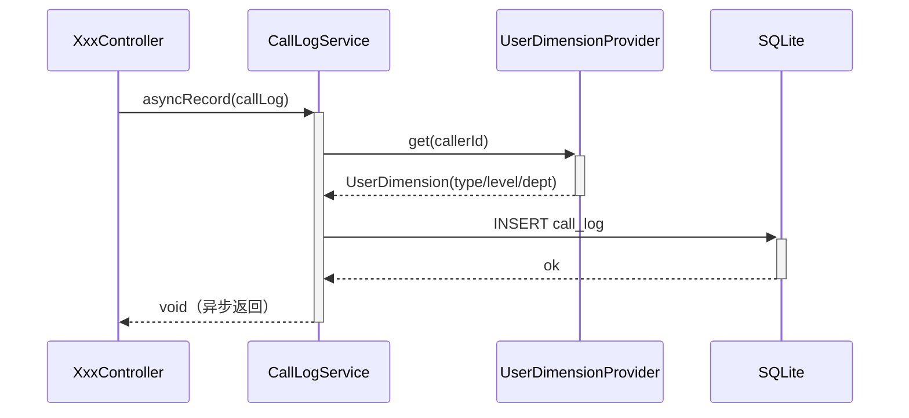

- 处理时序图（查询）
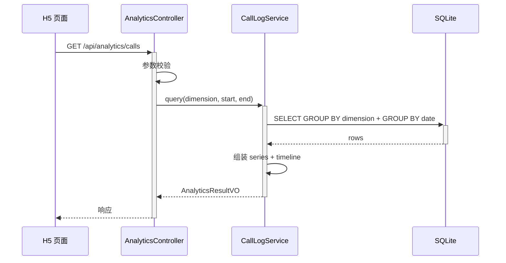

**业务规则：**
| 规则编号 | 规则描述 | 校验时机 | 不满足时的处理 |
|----------|----------|----------|--------------|
| R05 | dimension 白名单 | 始终 | 返回 ANA_001 |
| R06 | startTime <= endTime | 始终 | 返回 ANA_002 |
| R07 | 时间为空时默认近 7 日 | 始终 | 填充默认值 |

**异常场景：**
| 异常场景 | 处理方式 |
|----------|----------|
| UserDimensionProvider 失败 | 回填默认值（type=UNKNOWN/level=UNKNOWN/department=UNKNOWN），不中断埋点 |
| 聚合查询超时 | 返回 ANA_002 或空结果降级 |

**并发控制（如涉及数据写入）：**
- 并发场景：埋点写入为高并发追加日志。
- 控制策略：SQLite 写入加连接锁；生产切换 MySQL 后可分区/批量写入。无读写冲突（查询走时间/维度索引）。

### 5.4 前端算法演示页模块（iMoney-H5）

#### 5.4.1 表结构设计

前端无表。

##### 5.4.1.x 枚举与常量定义

| 枚举名称 | 取值 | 含义 | 关联字段 |
|----------|------|------|----------|
| TabKey | helloworld | HelloWorld Tab | Tab 切换 |
| TabKey | hash | 哈希算法 Tab | Tab 切换 |
| TabKey | bubble-sort | 冒泡排序 Tab | Tab 切换 |
| ChartType | line | 折线图（日趋势） | 报表图表 |
| ChartType | pie | 饼图（维度占比） | 报表图表 |
| ChartType | column | 柱状图（维度对比） | 报表图表 |

#### 5.4.2 接口（前端调用）详细设计

前端调用即第 4 章 W01~W05，复用契约。前端侧封装于 `src/pages/algorithm-demo/services.ts`。

#### 5.4.3 子功能详细设计

##### 5.4.3.1 三 Tab 展示（F06/F10）

- 处理时序图
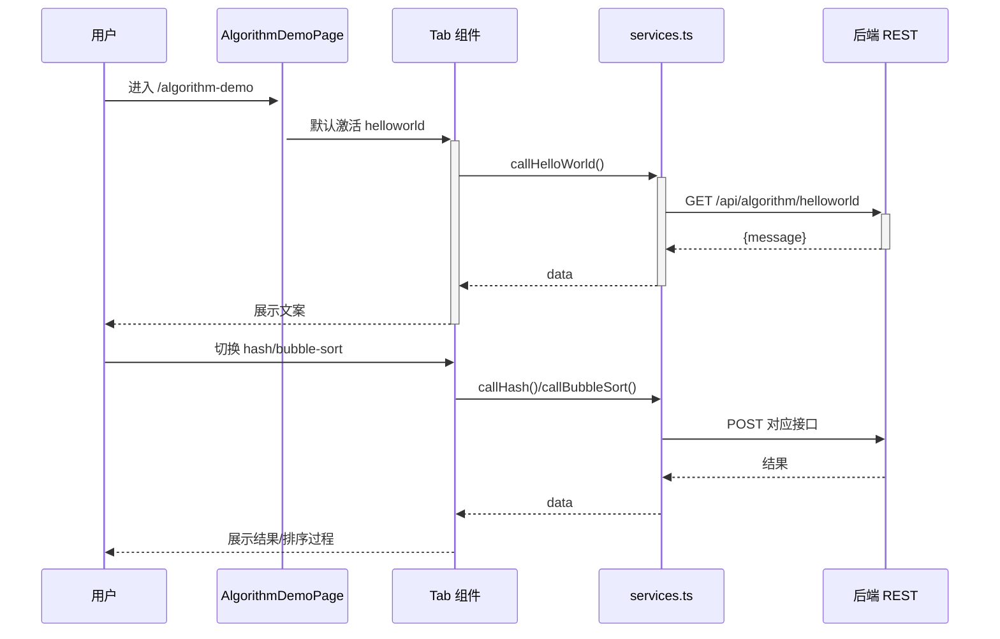

**业务规则：**
| 规则编号 | 规则描述 | 校验时机 | 不满足时的处理 |
|----------|----------|----------|--------------|
| R08 | 切换 Tab 触发对应接口 | 始终 | 显示加载/错误态 |
| R09 | 冒泡排序 Tab 可视化 steps | 始终 | steps 为空时仅展示结果 |

**异常场景：**
| 异常场景 | 处理方式 |
|----------|----------|
| 接口失败 | 展示重试按钮 |

##### 5.4.3.2 导出按钮（F07）

- 处理时序图
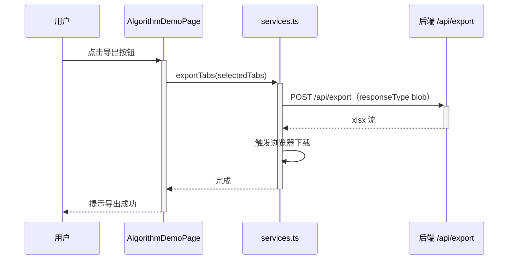

**业务规则：**
| 规则编号 | 规则描述 | 校验时机 | 不满足时的处理 |
|----------|----------|----------|--------------|
| R10 | 导出当前选中的 Tab | 始终 | 至少导出一个 Tab |

**异常场景：**
| 异常场景 | 处理方式 |
|----------|----------|
| 导出失败 | 提示"导出失败，请重试" |

##### 5.4.3.3 可视化报表（F08）

- 处理时序图
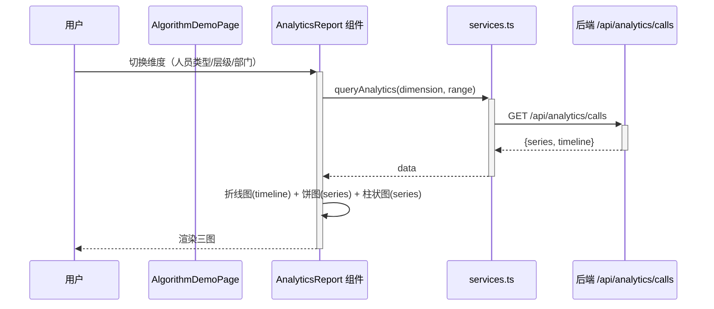

**业务规则：**
| 规则编号 | 规则描述 | 校验时机 | 不满足时的处理 |
|----------|----------|----------|--------------|
| R11 | 维度切换重新查询 | 始终 | 加载态 |
| R12 | 时间筛选默认近 7 日 | 始终 | 填充默认值 |

**异常场景：**
| 异常场景 | 处理方式 |
|----------|----------|
| 查询失败 | 展示空态 + 重试 |

**并发控制（如涉及数据写入）：**
- 并发场景：前端只读查询，无写入。
- 控制策略：无并发风险，原因：只读渲染。

## 6. 非功能性需求设计

### 6.1 高可用性
- 后端 Spring Boot 单实例演示；埋点写入失败降级（仅记日志，不影响主响应）。
- 前端接口失败展示重试，不阻断页面。

### 6.2 可扩展性
- 后端模块化（算法/导出/埋点），可水平扩展；SQLite 可切换 MySQL。
- 前端组件化（三 Tab + 报表独立组件），可复用。

### 6.3 稳定性/可靠性
- 冒泡排序数组长度上限 1000 防 OOM。
- 埋点异步隔离，主链路稳定。

### 6.4 安全性设计
#### 6.4.1 账户系统方案
- 演示场景不接入正式账户系统；身份由请求头 X-User-Id / X-User-Name 传递（演示用）。

#### 6.4.2 授权&访问控制
##### 6.4.2.1 是否实现水平权限检查
- 不涉及数据库查询/公共数据查询；演示场景不强制水平权限检查。

##### 6.4.2.2 是否实现垂直权限检查
- 演示场景不涉及角色权限。

##### 6.4.2.3 是否检查登录态
- 演示场景不检查登录态；生产接入需加全局拦截器。

#### 6.4.3 数据防护方案
##### 6.4.3.1 是否对敏感数据加密存储
- 演示无敏感数据加密需求。

##### 6.4.3.2 是否对敏感数据展示进行脱敏
- caller_name 在日志中如含真实姓名需脱敏；演示用 Mock 可不脱敏。

### 6.5 监控/统计/日志/告警
- call_log 即为统计埋点数据源；后端应用日志记录接口异常。
- 关键监控点：接口耗时（duration_ms）、调用状态（status）。

## 7. 变更三板斧

### 7.1 可监控
- call_log 表记录每次调用，可按 api/dimension/时间聚合监控。
- 接口耗时 duration_ms 可作为性能监控指标。

### 7.2 可灰度
- 前端新增页面路由 `/algorithm-demo`，对原有路由零影响，天然灰度（新页面独立访问）。
- 后端 `server/` 子目录独立部署，不影响 PH2498.github.io 静态内容。

### 7.3 可应急
- 前端页面可通过路由下线/隐藏入口应急。
- 后端接口可独立停服，前端回退 Mock（SP2/SP3 Mock 先行设计已预留）。
- 避免回滚依赖：前端页面与后端服务解耦，回滚任一侧不影响另一侧已有功能。
