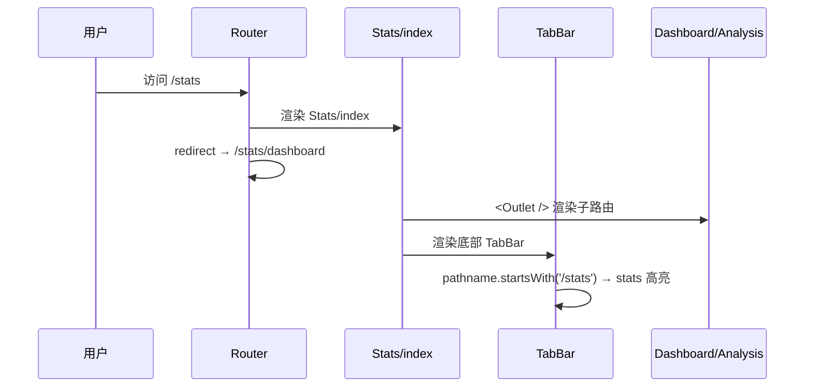
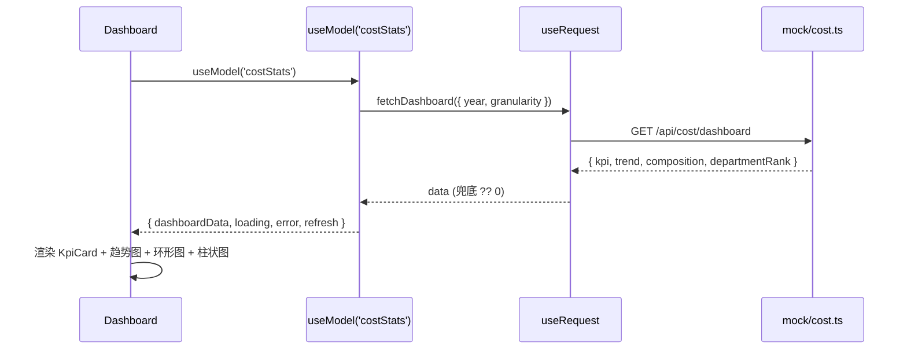
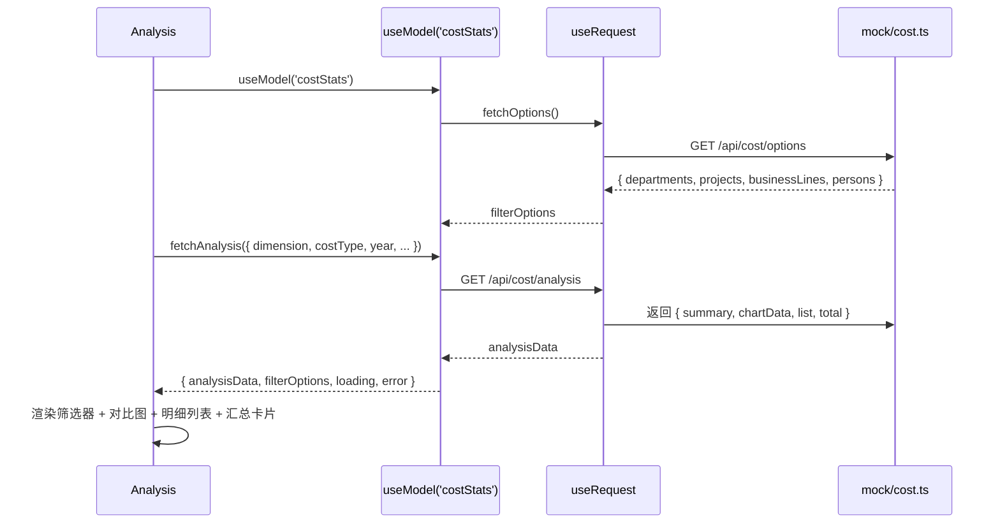
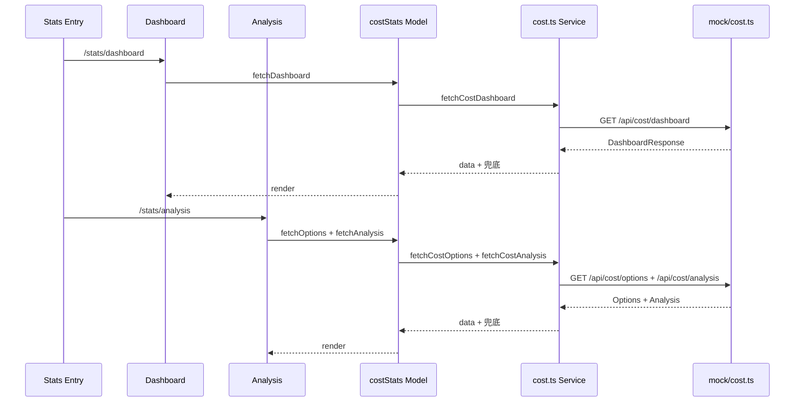

# 成本统计报表 — 系统分析与设计文档

| 项目 | 值 |
|---|---|
| 文档日期 | 2026-07-30 |
| 阶段 | 系分生成 |
| 采用技能 | dtazziboot-system-analysis-design |
| 需求来源 | docs/cost-report/2026-07-30-cost-statistics-requirement.md |
| 目标仓库 | iMoney-H5 |
| 状态 | 待评审 |

---

## 1. 需求分析

### 1.1 需求背景

开发一个成本统计报表，用于统计企业各项成本支出情况。前端新建成本统计分析页面以及 Dashboard，按照不同维度展示和统计数据：涉及部门、项目、业务线、人员、月份、季度、年度；人力成本以及项目成本等信息。

### 1.2 核心目标

| 序号 | 目标 | 说明 |
|---|---|---|
| ① | Dashboard 总览 | 成本概况与趋势展示，一屏掌握全局 |
| ② | 多维度成本分析 | 支持筛选下钻（部门/项目/业务线/人员/时间） |
| ③ | 成本类型区分 | 人力成本与项目成本分别统计、对比展示 |

### 1.3 维度模型

| 维度 | 字段 | 说明 |
|---|---|---|
| 部门 | `department` | 成本归属部门 |
| 项目 | `project` | 成本归属项目 |
| 业务线 | `businessLine` | 成本归属业务线 |
| 人员 | `person` | 人力成本时必填 |
| 月份 | `month` | 1-12 |
| 季度 | `quarter` | 1-4 |
| 年度 | `year` | 如 2026 |

时间粒度层级：`year → quarter → month`，支持同比/环比。

| 成本类型 | 字段 | 说明 |
|---|---|---|
| 人力成本 | `laborCost` | 人员薪酬、福利等 |
| 项目成本 | `projectCost` | 项目直接支出 |

### 1.4 用户场景

| 场景 | 用户角色 | 操作路径 |
|---|---|---|
| 成本总览 | 管理者 | 底部 Tab「统计」→ 进入 Dashboard |
| 趋势分析 | 财务 | Dashboard → 切换年/季/月粒度查看趋势折线 |
| 部门成本对比 | 部门负责人 | 分析页 → 筛选部门 → 查看对比柱状图 |
| 人力成本下钻 | 项目经理 | 分析页 → 切换人力成本 → 按人员筛选 |
| 成本明细查询 | 财务 | 分析页 → 明细列表分页浏览 |

---

## 2. 架构设计

### 2.1 技术架构

```
┌─────────────────────────────────────────────────────────────┐
│                    iMoney-H5 (Umi Max 4)                     │
│                                                              │
│  ┌─────────────┐  ┌──────────────┐  ┌────────────────────┐ │
│  │  Dashboard   │  │  Analysis    │  │  Stats 入口 (Tab)  │ │
│  │  /stats/     │  │  /stats/     │  │  /stats            │ │
│  │   dashboard  │  │   analysis   │  │  → redirect        │ │
│  └──────┬───────┘  └──────┬───────┘  └─────────┬──────────┘ │
│         │                  │                     │           │
│         ▼                  ▼                     ▼           │
│  ┌─────────────────────────────────────────────────────────┐ │
│  │           useModel('costStats') — Umi Model 数据层       │ │
│  │  状态管理 + useRequest 封装 + 数据兜底                    │ │
│  └──────────────────────────┬──────────────────────────────┘ │
│                             │                                │
│  ┌──────────────────────────▼──────────────────────────────┐ │
│  │              useRequest → request (Umi request:{})       │ │
│  │        HTTP 请求 + 拦截器 + 三级降级                      │ │
│  └──────────────────────────┬──────────────────────────────┘ │
│                             │                                │
│  ┌──────────────────────────▼──────────────────────────────┐ │
│  │  数据来源链路：真实后端 → Umi Mock → 空状态占位           │ │
│  │  proxy: .umirc.ts proxy → iMoney-Server (未挂载)         │ │
│  │  mock: mock/cost.ts (Mock-first 开发期)                   │ │
│  └─────────────────────────────────────────────────────────┘ │
│                                                              │
│  图表层：ant-design-mobile-chart (折线/环形/柱状)             │
│  UI 层：antd-mobile (Tab/List/Card/SwipeAction)              │
│  动画层：framer-motion + MotionWrap                          │
└─────────────────────────────────────────────────────────────┘
                          │ proxy
                          ▼
┌─────────────────────────────────────────────────────────────┐
│              iMoney-Server (编码阶段申请挂载)                │
│  Node.js + Express + TypeScript + SQLite(开发)/MySQL(生产)  │
└─────────────────────────────────────────────────────────────┘
```

### 2.2 技术选型

| 层面 | 选型 | 版本 | 依据 | 已验证状态 |
|---|---|---|---|---|
| 框架 | @umijs/max | ^4.6.68 | 现有仓库基座 | ✅ package.json 已有 |
| UI 组件 | antd-mobile | ^5.42.3 | 现有 UI 库 | ✅ package.json 已有 |
| 图表 | ant-design-mobile-chart | ^1.2.2 | 移动端图表，与 antd-mobile 配套 | ✅ package.json 已有 |
| 动画 | framer-motion | ^12.42.0 | 现有动画库 | ✅ package.json 已有 |
| 数据流 | useModel (Umi model) | - | 现有模式（global.ts 先例） | ✅ .umirc.ts model:{} 已配 |
| 请求 | useRequest (Umi request) | - | 现有模式 | ✅ .umirc.ts request:{} 已配 |
| Mock | Umi mock 目录 | - | 现有模式（userAPI.ts 先例） | ✅ mock/ 目录已存在 |
| 后端 | Node.js + Express + TS | - | 与前端同语言，降低维护成本 | ⏳ 编码阶段申请挂载 |
| 数据库 | SQLite(开发) → MySQL(生产) | - | 开发零配置，生产可切换 | ⏳ 后端仓库接入后 |

### 2.3 路由架构

当前 `.umirc.ts` 路由（已验证）：

```typescript
// 现有路由
{ name: '统计', path: '/stats', component: './Stats' }
```

编码阶段调整为嵌套子路由（本期不改文件）：

```typescript
// 设计后路由
{
  path: '/stats',
  redirect: '/stats/dashboard',
}
{
  name: '成本总览',
  path: '/stats/dashboard',
  component: './Stats/Dashboard',
}
{
  name: '成本分析',
  path: '/stats/analysis',
  component: './Stats/Analysis',
}
```

底部 TabBar `TAB_BARS`（已验证 `constants/index.ts`）中 `{ key:'stats', path:'/stats' }` 的 `isTabActive` 逻辑使用 `pathname.startsWith(path)`，子路由 `/stats/dashboard`、`/stats/analysis` 均以 `/stats` 开头，TabBar 高亮逻辑**无需改动**，天然兼容。

---

## 3. 数据模型设计

### 3.1 TypeScript 接口定义

```typescript
/** 成本类型枚举 */
type CostType = 'labor' | 'project';

/** 时间粒度枚举 */
type Granularity = 'year' | 'quarter' | 'month';

/** 维度枚举 */
type Dimension = 'department' | 'project' | 'businessLine' | 'person';

/** 成本记录（明细） */
interface CostRecord {
  id: string;
  department: string;
  project: string;
  businessLine: string;
  person?: string;          // 人力成本时必填
  costType: CostType;
  amount: number;           // 元
  date: string;              // YYYY-MM-DD
  year: number;
  quarter: number;          // 1-4
  month: number;            // 1-12
  remark?: string;
}

/** 维度汇总 */
interface CostSummary {
  dimension: string;        // 维度值（如部门名）
  totalCost: number;
  laborCost: number;
  projectCost: number;
  count: number;
}

/** 趋势数据点 */
interface CostTrend {
  period: string;           // 如 "2026-01" / "2026-Q1" / "2026"
  totalCost: number;
  laborCost: number;
  projectCost: number;
}

/** KPI 卡片数据 */
interface CostKpi {
  totalCost: number;
  laborCost: number;
  projectCost: number;
  yoyChangeRate: number;     // 同比变化率（%）
}

/** 成本构成 */
interface CostComposition {
  laborCost: number;
  projectCost: number;
}

/** 分析页汇总统计 */
interface CostAnalysisSummary {
  totalCost: number;
  laborCost: number;
  projectCost: number;
  avgCost: number;
  maxCost: number;
  minCost: number;
  count: number;
}

/** 筛选选项 */
interface CostFilterOptions {
  departments: string[];
  projects: string[];
  businessLines: string[];
  persons: string[];
}
```

### 3.2 数据流

```
Component
  │ useModel('costStats')
  ▼
costStats model (src/models/costStats.ts)
  │ useRequest(apiFunc)
  ▼
Umi request (src/services/cost.ts)
  │ GET /api/cost/*
  ▼
数据来源三级降级
  ├─ 真实后端 (iMoney-Server, proxy 代理)
  ├─ Umi Mock (mock/cost.ts, 开发期)
  └─ 空状态占位 (组件层 fallback)
```

### 3.3 后端数据库表设计（iMoney-Server，编码阶段参考）

```sql
CREATE TABLE cost_record (
  id            VARCHAR(36) PRIMARY KEY,
  department    VARCHAR(64)  NOT NULL,
  project       VARCHAR(128) NOT NULL,
  business_line VARCHAR(64)  NOT NULL,
  person        VARCHAR(64),
  cost_type     VARCHAR(16)  NOT NULL,  -- labor | project
  amount        DECIMAL(14,2) NOT NULL,
  date          DATE NOT NULL,
  year          INT NOT NULL,
  quarter       INT NOT NULL,
  month         INT NOT NULL,
  remark        TEXT,
  created_at    TIMESTAMP DEFAULT CURRENT_TIMESTAMP,
  INDEX idx_date (date),
  INDEX idx_dept_date (department, date),
  INDEX idx_cost_type (cost_type, date),
  INDEX idx_year_quarter (year, quarter)
);
```

---

## 4. API 接口设计

### 4.1 全局约定

| 项 | 约定 |
|---|---|
| 响应格式 | `{ code: number, msg: string, data: T }` |
| 成功 | `code: 0, msg: 'success'` |
| 业务错误 | `code: 非0, msg: 错误描述` |
| HTTP 错误 | 前端拦截器统一处理，降级至 Mock |
| 金额单位 | 元（number），前端展示保留 2 位小数，大额折叠万元 |

### 4.2 接口清单

#### 4.2.1 Dashboard 聚合

| 项 | 值 |
|---|---|
| URI | `GET /api/cost/dashboard` |
| 用途 | 获取 Dashboard 总览数据（KPI + 趋势 + 构成 + 部门排名） |

**入参**：

| 参数 | 类型 | 必填 | 默认值 | 说明 |
|---|---|---|---|---|
| year | number | 否 | 当前年份 | 如 2026 |
| granularity | string | 否 | `month` | 枚举：`year` / `quarter` / `month` |

**出参**：

```typescript
interface DashboardResponse {
  kpi: CostKpi;
  trend: CostTrend[];
  composition: CostComposition;
  departmentRank: CostSummary[];
}
```

**请求示例**：
```
GET /api/cost/dashboard?year=2026&granularity=month
```

**响应示例**：
```json
{
  "code": 0,
  "msg": "success",
  "data": {
    "kpi": {
      "totalCost": 1280000.50,
      "laborCost": 860000.00,
      "projectCost": 420000.50,
      "yoyChangeRate": 12.5
    },
    "trend": [
      { "period": "2026-01", "totalCost": 95000.00, "laborCost": 65000.00, "projectCost": 30000.00 },
      { "period": "2026-02", "totalCost": 102000.00, "laborCost": 70000.00, "projectCost": 32000.00 }
    ],
    "composition": { "laborCost": 860000.00, "projectCost": 420000.50 },
    "departmentRank": [
      { "dimension": "研发部", "totalCost": 520000.00, "laborCost": 380000.00, "projectCost": 140000.00, "count": 45 },
      { "dimension": "市场部", "totalCost": 310000.00, "laborCost": 200000.00, "projectCost": 110000.00, "count": 28 }
    ]
  }
}
```

#### 4.2.2 成本分析明细

| 项 | 值 |
|---|---|
| URI | `GET /api/cost/analysis` |
| 用途 | 按维度筛选获取成本明细、汇总、对比图数据 |

**入参**：

| 参数 | 类型 | 必填 | 默认值 | 说明 |
|---|---|---|---|---|
| dimension | string | 是 | - | 枚举：`department` / `project` / `businessLine` / `person` |
| costType | string | 否 | `all` | 枚举：`labor` / `project` / `all` |
| year | number | 否 | 当前年份 | |
| quarter | number | 否 | - | 1-4 |
| month | number | 否 | - | 1-12 |
| department | string | 否 | - | 筛选指定部门 |
| project | string | 否 | - | 筛选指定项目 |
| businessLine | string | 否 | - | 筛选指定业务线 |
| person | string | 否 | - | 筛选指定人员 |
| page | number | 否 | 1 | 分页页码 |
| pageSize | number | 否 | 20 | 每页条数 |

**出参**：

```typescript
interface AnalysisResponse {
  summary: CostAnalysisSummary;
  chartData: CostSummary[];
  list: CostRecord[];
  total: number;
}
```

**请求示例**：
```
GET /api/cost/analysis?dimension=department&costType=labor&year=2026&quarter=1&page=1&pageSize=20
```

**响应示例**：
```json
{
  "code": 0,
  "msg": "success",
  "data": {
    "summary": {
      "totalCost": 320000.00,
      "laborCost": 320000.00,
      "projectCost": 0,
      "avgCost": 16000.00,
      "maxCost": 28000.00,
      "minCost": 8000.00,
      "count": 20
    },
    "chartData": [
      { "dimension": "研发部", "totalCost": 180000.00, "laborCost": 180000.00, "projectCost": 0, "count": 12 },
      { "dimension": "市场部", "totalCost": 140000.00, "laborCost": 140000.00, "projectCost": 0, "count": 8 }
    ],
    "list": [
      {
        "id": "rec-001",
        "department": "研发部",
        "project": "iMoney-H5",
        "businessLine": "支付",
        "person": "张三",
        "costType": "labor",
        "amount": 28000.00,
        "date": "2026-01-15",
        "year": 2026,
        "quarter": 1,
        "month": 1,
        "remark": "1月薪酬"
      }
    ],
    "total": 20
  }
}
```

#### 4.2.3 筛选选项

| 项 | 值 |
|---|---|
| URI | `GET /api/cost/options` |
| 用途 | 获取各维度可用筛选选项列表 |

**入参**：无

**出参**：

```typescript
interface OptionsResponse {
  departments: string[];
  projects: string[];
  businessLines: string[];
  persons: string[];
}
```

**响应示例**：
```json
{
  "code": 0,
  "msg": "success",
  "data": {
    "departments": ["研发部", "市场部", "财务部", "运营部"],
    "projects": ["iMoney-H5", "iMoney", "支付中台", "风控系统"],
    "businessLines": ["支付", "风控", "营销", "基础"],
    "persons": ["张三", "李四", "王五", "赵六"]
  }
}
```

### 4.3 错误码

| 错误码 | 含义 | 触发场景 |
|---|---|---|
| 0 | 成功 | 正常响应 |
| COST_001 | 参数非法 | dimension 缺失、year 非法等 |
| COST_002 | 查询失败 | DB 查询异常 |
| COST_003 | 聚合超时 | 查询超 5s |

---

## 5. 功能模块设计

### 5.1 全局约定

| 项 | 约定 |
|---|---|
| 错误码格式 | `COST_{SEQ}` |
| 通用出参结构 | `{ code, msg, data }` |
| 金额展示 | 保留 2 位小数，≥10000 折叠为「X.XX万元」 |
| 分页 | 每页 20 条 |
| 默认时间范围 | 当年（2026）+ 月粒度 |

### 5.2 模块 A：成本报表入口（Stats Entry）

**职责**：`/stats` 路由入口，自动重定向至 Dashboard，承载子路由布局。

**文件清单**：

| 文件路径 | 职责 |
|---|---|
| `src/pages/Stats/index.tsx` | 改造为子路由 `<Outlet />` 容器 + TabBar |
| `src/pages/Stats/index.less` | 入口布局样式 |

**调用时序**：



**业务规则**：

| 规则 | 说明 |
|---|---|
| 默认重定向 | `/stats` → `/stats/dashboard` |
| 未知子路由 | 回退至 Dashboard |
| TabBar 兼容 | `isTabActive` 用 `startsWith('/stats')`，子路由天然兼容 |

### 5.3 模块 B：Dashboard 总览

**职责**：成本概况一屏展示，含 KPI 卡片、趋势折线、构成环形图、部门排名柱状图、时间粒度切换。

**文件清单**：

| 文件路径 | 职责 |
|---|---|
| `src/pages/Stats/Dashboard/index.tsx` | Dashboard 页面容器 |
| `src/pages/Stats/Dashboard/index.less` | Dashboard 样式 |
| `src/components/cost/KpiCard.tsx` | KPI 数值卡片 |
| `src/components/cost/CostTrendChart.tsx` | 趋势折线图 |
| `src/components/cost/CostCompositionChart.tsx` | 构成环形图 |
| `src/components/cost/DepartmentRankChart.tsx` | 部门排名柱状图 |
| `src/components/cost/GranularityTab.tsx` | 时间粒度切换 Tab |

**调用时序**：



**业务规则表**：

| 规则 | 说明 |
|---|---|
| 默认粒度 | month（月） |
| 粒度切换 | Tab 切换触发重新请求 |
| 趋势数据上限 | 近 12 个周期（月=12月，季=4季，年=近年） |
| 空数据 | KPI 卡片展示 `--`，图表展示「暂无数据」占位 |
| 金额折叠 | ≥10000 → 「X.XX万元」 |

**异常场景表**：

| 异常场景 | 兜底策略 |
|---|---|
| API 请求超时/网络错误 | `useRequest` errorThrower + 重试按钮 + 空状态图 |
| 接口返回空数据 | 图表「暂无数据」，KPI 展示 `--` |
| 接口字段缺失/null | 数据层 `?? 0` 兜底，金额 `Number(x) \|\| 0` |
| 图表渲染异常 | 外层 try-catch，降级为纯文字统计 |

### 5.4 模块 C：成本分析页

**职责**：多维度筛选 + 成本类型切换 + 对比图 + 明细列表 + 汇总统计。

**文件清单**：

| 文件路径 | 职责 |
|---|---|
| `src/pages/Stats/Analysis/index.tsx` | 分析页容器 |
| `src/pages/Stats/Analysis/index.less` | 分析页样式 |
| `src/components/cost/CostFilterBar.tsx` | 维度筛选器（下拉/级联） |
| `src/components/cost/CostTypeTab.tsx` | 成本类型切换 Tab（人力/项目/全部） |
| `src/components/cost/DimensionBarChart.tsx` | 维度对比柱状图/条形图 |
| `src/components/cost/CostDetailList.tsx` | 明细列表（分页） |
| `src/components/cost/CostSummaryCard.tsx` | 汇总统计卡片 |

**调用时序**：



**业务规则表**：

| 规则 | 说明 |
|---|---|
| 默认维度 | department |
| 默认成本类型 | all |
| 默认时间 | 当年 2026 |
| 筛选联动 | 维度/类型/时间变更 → 重新请求 |
| 明细分页 | 每页 20 条，下拉加载更多 |
| 维度对比图 | 按当前 dimension 聚合展示柱状图 |

**异常场景表**：

| 异常场景 | 兜底策略 |
|---|---|
| 筛选选项为空 | 下拉框展示「暂无选项」 |
| 分析结果为空 | 对比图「暂无数据」，列表展示空状态 |
| 字段缺失/null | 数据层 `?? 0` 兜底 |
| 分页加载失败 | 展示「加载失败，点击重试」 |

### 5.5 模块 D：数据层（Model + Service + Mock）

**职责**：Umi Model 状态管理 + useRequest 封装 + Mock 数据 + 数据兜底。

**文件清单**：

| 文件路径 | 职责 |
|---|---|
| `src/models/costStats.ts` | Umi Model 数据层（状态 + 请求封装 + 兜底） |
| `src/services/cost.ts` | API 请求函数封装 |
| `mock/cost.ts` | Mock 接口（dashboard / analysis / options） |
| `src/utils/costFormat.ts` | 金额格式化工具（元 → 万元折叠） |

**数据层设计**：

```typescript
// src/models/costStats.ts (设计，编码阶段实现)
const useCostStats = () => {
  // Dashboard
  const [dashboardParams, setDashboardParams] = useState({
    year: 2026, granularity: 'month' as Granularity
  });
  const dashboardReq = useRequest(
    () => fetchCostDashboard(dashboardParams),
    { refreshDeps: [dashboardParams] }
  );

  // Analysis
  const [analysisParams, setAnalysisParams] = useState({
    dimension: 'department' as Dimension,
    costType: 'all' as CostType | 'all',
    year: 2026, page: 1, pageSize: 20,
  });
  const analysisReq = useRequest(
    () => fetchCostAnalysis(analysisParams),
    { refreshDeps: [analysisParams] }
  );

  // Filter Options
  const optionsReq = useRequest(fetchCostOptions);

  return {
    // Dashboard
    dashboardData: dashboardReq.data,
    dashboardLoading: dashboardReq.loading,
    dashboardError: dashboardReq.error,
    refreshDashboard: dashboardReq.refresh,
    dashboardParams, setDashboardParams,
    // Analysis
    analysisData: analysisReq.data,
    analysisLoading: analysisReq.loading,
    analysisError: analysisReq.error,
    refreshAnalysis: analysisReq.refresh,
    analysisParams, setAnalysisParams,
    // Options
    filterOptions: optionsReq.data,
    optionsLoading: optionsReq.loading,
  };
};
export default useCostStats;
```

**数据兜底规则**：

| 场景 | 策略 |
|---|---|
| 字段缺失/null | `data?.kpi?.totalCost ?? 0` |
| 金额非法 | `Number(x) \|\| 0` |
| 数组缺失 | `data?.trend ?? []` |
| 整体失败 | 返回 `null`，组件层展示空状态 |

### 5.6 模块 E：共享组件层

**职责**：可复用的成本图表与 UI 组件。

**文件清单**：

| 文件路径 | 职责 | 复用图表库 |
|---|---|---|
| `src/components/cost/KpiCard.tsx` | KPI 数值卡片（总成本/人力/项目/同比率） | antd-mobile Card |
| `src/components/cost/CostTrendChart.tsx` | 趋势折线图 | ant-design-mobile-chart Line |
| `src/components/cost/CostCompositionChart.tsx` | 构成环形图 | ant-design-mobile-chart Pie/Ring |
| `src/components/cost/DepartmentRankChart.tsx` | 部门排名柱状图 | ant-design-mobile-chart Column |
| `src/components/cost/DimensionBarChart.tsx` | 维度对比柱状图 | ant-design-mobile-chart Column |
| `src/components/cost/GranularityTab.tsx` | 时间粒度切换 | antd-mobile Tabs |
| `src/components/cost/CostTypeTab.tsx` | 成本类型切换 | antd-mobile Tabs |
| `src/components/cost/CostFilterBar.tsx` | 筛选器 | antd-mobile Picker/Cascade |
| `src/components/cost/CostDetailList.tsx` | 明细列表 | antd-mobile List |
| `src/components/cost/CostSummaryCard.tsx` | 汇总统计卡片 | antd-mobile Card |

**组件设计约定**：

| 约定 | 说明 |
|---|---|
| 动画 | 统一使用 `MotionWrap`（fade/slideUp），与现有页面一致 |
| 样式 | CSS Modules（`.less` 文件），与现有 `index.less` 模式一致 |
| 空状态 | 统一 `<Empty />` 占位组件 |
| 加载态 | `Skeleton` 骨架屏 |

### 5.7 跨模块调用链



---

## 6. 异常兜底设计

### 6.1 前端异常兜底

| 异常场景 | 兜底策略 | 实现层 |
|---|---|---|
| API 请求超时/网络错误 | `useRequest` 配置 `errorThrower` + 全局 ErrorBoundary，展示重试按钮 + 空状态图 | Model + 组件 |
| 接口返回空数据 | 图表区域展示「暂无数据」占位，KPI 卡片展示 `--` | 组件 |
| 接口字段缺失/null | 数据层做 `?? 0` 兜底，金额统一 `Number(x) \|\| 0` | Model/Service |
| 图表渲染异常 | ant-design-mobile-chart 外层 try-catch，异常时降级为纯文字统计 | 图表组件 |
| 大额数据渲染卡顿 | 趋势图默认仅展示近 12 个月，明细列表分页（每页 20 条） | Model + 组件 |
| 路由不匹配 | `/stats` 自动 redirect 至 `/stats/dashboard`，未知子路由回退 | 路由配置 |

### 6.2 后端异常兜底（iMoney-Server，编码阶段参考）

| 异常场景 | 兜底策略 |
|---|---|
| DB 查询失败 | 返回统一错误体 `{ code: 500, message, data: null }`，记录日志 |
| 聚合计算超时 | 查询超时 5s 中断，返回缓存上次结果 + `stale: true` 标记 |
| 入参非法 | 参数校验中间件拦截，返回 400 + 字段级错误信息 |
| 服务未启动 | 前端 proxy 失败时自动降级至 Umi Mock（开发期） |

### 6.3 降级链路

```
真实后端 (iMoney-Server)  ──失败──▶  Umi Mock (mock/cost.ts)  ──失败──▶  空状态占位
```

前端 `request` 拦截器统一处理：HTTP 非 2xx → 业务 code 非 0 → 网络异常，三级降级。

---

## 7. 跨仓对齐检查

| 检查项 | 结论 | 依据 |
|---|---|---|
| 跨库接口依赖 | 无。成本报表为 iMoney-H5 独立模块 | 需求文档 §11 |
| 跨库契约兼容性 | 全部新增 API，向后兼容 | 新增接口不改现有契约 |
| iMoney 小程序同步 | 不需要，无统计基础设施 | iMoney src/pages 无统计模块 |
| 图表依赖 | `ant-design-mobile-chart ^1.2.2` 已在 package.json | ✅ 已验证 |
| antd-mobile 依赖 | `^5.42.3` 已在 package.json | ✅ 已验证 |
| framer-motion 依赖 | `^12.42.0` 已在 package.json | ✅ 已验证 |
| Umi model 配置 | `.umirc.ts` `model: {}` 已配置 | ✅ 已验证 |
| Umi request 配置 | `.umirc.ts` `request: {}` 已配置 | ✅ 已验证 |
| 路由冲突 | 无，新增子路由 `/stats/dashboard`、`/stats/analysis` 不冲突 | ✅ .umirc.ts 已验证现有 `/stats` |
| TabBar 兼容 | `isTabActive` 用 `startsWith('/stats')`，子路由天然兼容 | ✅ TabBar.tsx 已验证 |
| Mock 先例 | `mock/userAPI.ts` 已有 mock 模式先例 | ✅ 已验证 |
| Model 先例 | `src/models/global.ts` 已有 useModel 模式 | ✅ 已验证 |
| MotionWrap | `variant: fade/slideUp/slideLeft/scale` 可用 | ✅ 已验证 |
| Stats 骨架 | `src/pages/Stats/index.tsx` 存在占位骨架 | ✅ 已验证 |
| 后端仓库 | 需新建 `iMoney-Server`，当前工作区未挂载 | 编码阶段申请 |

---

## 8. 技术选型方案对比

### 8.1 数据流方案

| 方案 | 优势 | 劣势 | 推荐 |
|---|---|---|---|
| A. useModel + useRequest | 与现有 `global.ts` 模式一致；Umi 原生集成；`refreshDeps` 自动刷新 | 无 | ✅ 采用 |
| B. Redux Toolkit | 状态管理强大 | 引入新依赖，与现有模式不符；过度设计 | ❌ |
| C. Zustand | 轻量 | 引入新依赖；Umi useModel 已满足 | ❌ |

**推荐方案 A**：与现有 `src/models/global.ts` useModel 模式一致，`.umirc.ts` 已配 `model: {}`，零新增依赖。

### 8.2 图表方案

| 方案 | 优势 | 劣势 | 推荐 |
|---|---|---|---|
| A. ant-design-mobile-chart | 已安装；与 antd-mobile 配套；移动端优化 | 图表类型有限但满足需求 | ✅ 采用 |
| B. @antv/f2 | 功能强大 | 需新增依赖；与 antd-mobile 风格不一致 | ❌ |
| C. ECharts | 功能最全 | 体积大；移动端体验一般 | ❌ |

**推荐方案 A**：`ant-design-mobile-chart ^1.2.2` 已在 package.json，满足折线/环形/柱状需求，零新增依赖。

### 8.3 后端方案

| 方案 | 优势 | 劣势 | 推荐 |
|---|---|---|---|
| A. Node.js + Express + TS + SQLite | 与前端同语言；轻量；开发零配置 | 生产需迁移 MySQL | ✅ 采用（开发期） |
| B. Java + Spring Boot | 企业级成熟 | 与前端异构；重 | ❌ |
| C. 纯 Mock（不建后端） | 零成本 | 无法生产部署 | ❌（仅开发期过渡） |

**推荐方案 A**：开发期 Mock-first + 后端 SQLite，生产切换 MySQL。编码阶段申请挂载 `iMoney-Server` worktree。

---

## 9. 前端组件清单（编码阶段实现参考）

| 序号 | 文件路径 | 职责 | 类型 |
|---|---|---|---|
| 1 | `src/pages/Stats/index.tsx` | 改造为子路由 Outlet 容器 + TabBar | 改造 |
| 2 | `src/pages/Stats/index.less` | 入口布局样式 | 改造 |
| 3 | `src/pages/Stats/Dashboard/index.tsx` | Dashboard 总览 | 新增 |
| 4 | `src/pages/Stats/Dashboard/index.less` | Dashboard 样式 | 新增 |
| 5 | `src/pages/Stats/Analysis/index.tsx` | 成本分析页 | 新增 |
| 6 | `src/pages/Stats/Analysis/index.less` | 分析页样式 | 新增 |
| 7 | `src/models/costStats.ts` | Umi Model 数据层 | 新增 |
| 8 | `src/services/cost.ts` | API 请求封装 | 新增 |
| 9 | `src/utils/costFormat.ts` | 金额格式化工具 | 新增 |
| 10 | `src/components/cost/KpiCard.tsx` | KPI 数值卡片 | 新增 |
| 11 | `src/components/cost/CostTrendChart.tsx` | 趋势折线图 | 新增 |
| 12 | `src/components/cost/CostCompositionChart.tsx` | 构成环形图 | 新增 |
| 13 | `src/components/cost/DepartmentRankChart.tsx` | 部门排名柱状图 | 新增 |
| 14 | `src/components/cost/DimensionBarChart.tsx` | 维度对比柱状图 | 新增 |
| 15 | `src/components/cost/GranularityTab.tsx` | 时间粒度切换 | 新增 |
| 16 | `src/components/cost/CostTypeTab.tsx` | 成本类型切换 | 新增 |
| 17 | `src/components/cost/CostFilterBar.tsx` | 筛选器 | 新增 |
| 18 | `src/components/cost/CostDetailList.tsx` | 明细列表 | 新增 |
| 19 | `src/components/cost/CostSummaryCard.tsx` | 汇总统计卡片 | 新增 |
| 20 | `mock/cost.ts` | Mock 接口 | 新增 |
| 21 | `.umirc.ts` | 路由调整（嵌套子路由） | 改造 |

---

## 10. 已确认默认值

| 确认项 | 默认值 | 依据 |
|---|---|---|
| 目标仓库 | 仅 iMoney-H5 | 唯一具备图表库 + Stats 骨架的仓库 |
| 数据来源 | Mock 驱动 + API 契约规范 | 无后端仓库，先 Mock 后对接 |
| MVP 范围 | Dashboard + 分析页（分层展示） | 需求明确要两者 |
| 后端技术栈 | Node.js + Express + TypeScript | 与前端同语言，降低维护成本 |
| 数据库 | SQLite（开发）→ MySQL（生产） | 开发零配置，生产可切换 |
| 金额单位 | 元，展示保留 2 位小数，大额折叠万元 | 财务统计通用规范 |
| 权限控制 | 本期不做，预留路由守卫扩展点 | YAGNI，后续按需加 |
| 分页 | 明细列表每页 20 条 | 移动端性能考量 |
| 时间范围默认 | 当年（2026）+ 月粒度 | 最常用查询场景 |
| 默认维度 | department | 最常用分析维度 |
| 默认成本类型 | all | 全量展示后再筛选 |

---

## 11. 验收标准

| 序号 | 验收项 | 验证方式 |
|---|---|---|
| 1 | `/stats` 进入成本报表，默认展示 Dashboard | 路由访问验证 |
| 2 | Dashboard 含 KPI 卡片 + 趋势折线 + 构成环形图 + 部门排名柱状图 | 页面渲染检查 |
| 3 | 可切换年/季/月时间粒度 | GranularityTab 交互验证 |
| 4 | 分析页支持维度筛选 + 成本类型切换 | CostFilterBar + CostTypeTab 交互 |
| 5 | 明细列表正确展示筛选数据 | 列表数据与筛选条件匹配 |
| 6 | 数据来源 Mock 接口，契约符合 §4 | mock/cost.ts 接口验证 |
| 7 | 异常场景有兜底（空数据/超时/渲染失败均有占位或降级） | 异常注入测试 |
| 8 | 风格与现有 iMoney-H5（antd-mobile + MotionWrap）一致 | 视觉走查 |

---

## 12. 风险与依赖

| 风险项 | 影响 | 缓解措施 |
|---|---|---|
| 后端仓库未挂载 | 编码阶段无法联调真实 API | Mock-first 开发，契约规范确保切换零改动 |
| ant-design-mobile-chart 图表类型 | 环形图/柱状图 API 需验证 | 编码阶段查阅图表库文档验证 |
| 大额数据性能 | 明细列表渲染卡顿 | 分页 20 条 + 趋势图近 12 期 |
| 移动端视口适配 | postcss-px-to-viewport 已配 375 基准 | 复用现有配置，图表高度用 vw |

---

## 13. 设计产物清点

| 产物 | 路径 | 状态 |
|---|---|---|
| 系分设计文档 | `.agents/system.changes/design.md` | ✅ 本文件 |

> 本阶段为系分生成，仅产出设计文档，未修改任何代码文件。编码实现阶段按本设计文档执行。
