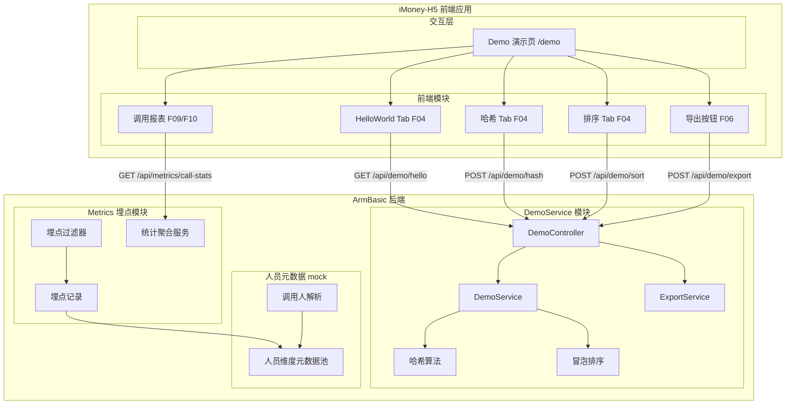
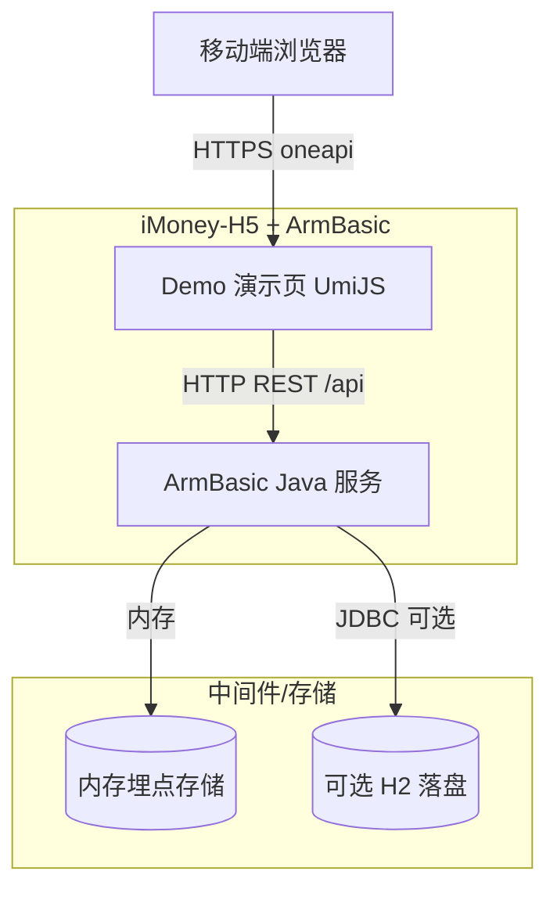
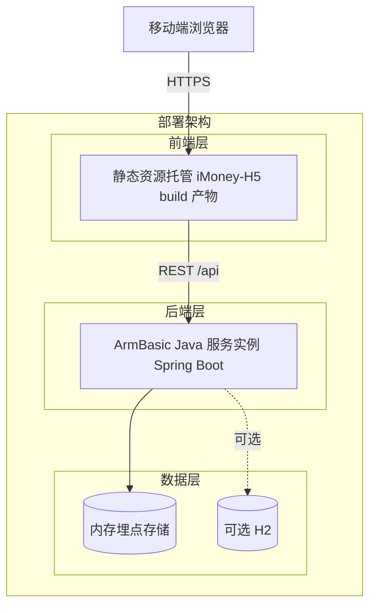
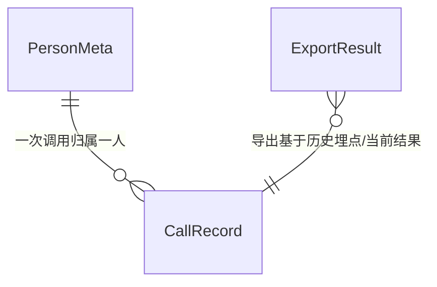
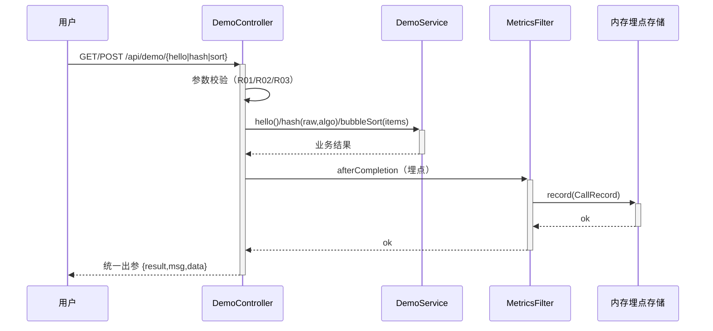
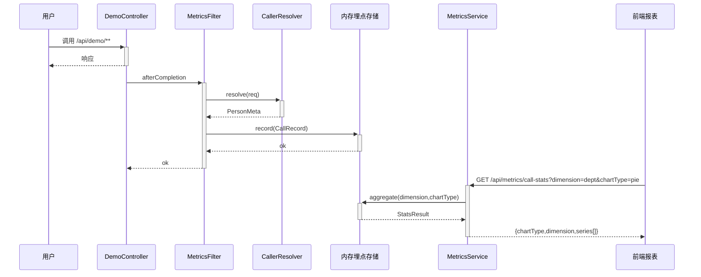
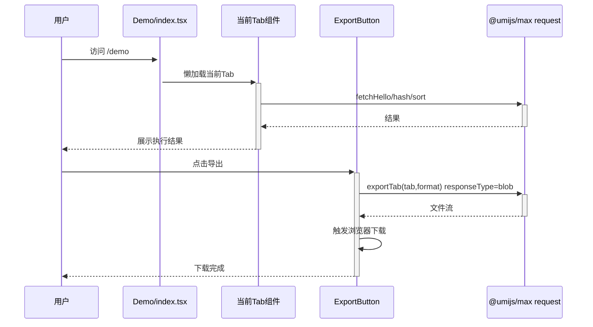
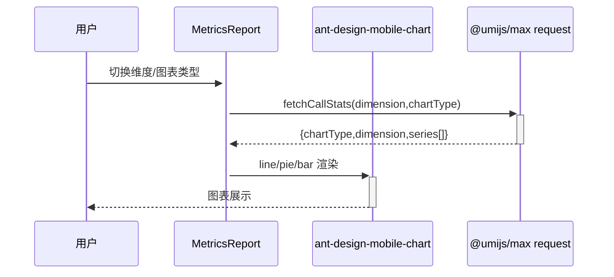

> **文档元信息**
>
> | 项目 | 内容 |
> |------|------|
> | 文档版本 | v1.0 |
> | 作者 | DTCoder（系分生成阶段自动产出） |
> | 创建日期 | 2026-07-30 |
> | 需求来源 | iMoney-H5 `docs/requirements/2026-07-30-demo-and-metrics-clarification.md`（需求澄清阶段产物） |
> | 评审状态 | 待评审 |

# 算法演示与调用埋点可视化 系分设计

## 1. 需求与范围

### 背景与目标

本需求面向 iMoney-H5 移动端，提供一个"算法演示 + 调用埋点可视化"的体验页：后端以 **Java** 实现三个演示接口（HelloWorld、哈希算法、冒泡排序），前端以三 Tab 分别展示各接口执行结果；新增导出按钮与后台导出接口，支持导出各 Tab 的展示结果；后端对接口调用做埋点，采集调用次数与调用人；前端在当前页面上以折线图、饼图、柱状图三种形式、按人员类型/人员层级/人员部门等维度可视化展示调用情况。

### 核心功能

- 三后端接口：HelloWorld、哈希算法（支持 md5/sha1/sha256）、冒泡排序。
- 前端三 Tab 演示页，分别展示三种执行结果。
- 导出接口 + 导出按钮，导出各 Tab 结果（CSV 优先，支持 XLSX）。
- 后端埋点：采集调用次数、调用人及人员维度元数据。
- 前端可视化报表：折线图/饼图/柱状图，按人员类型/层级/部门多维度展示。

### 约束与非功能要求

- 后端语言强制 **Java**（需求原始描述明确要求）。ArmBasic 当前为 Python 工程，无 Java 工程基础，需在其下新建 Java/Maven 工程模块承载后端能力。
- 前端技术栈固定为 iMoney-H5 现有栈：UmiJS Max + React + TypeScript + antd-mobile。图表库复用现有 `ant-design-mobile-chart@1.2.2`（已支持折线/饼/柱），不额外引入 echarts（安全兜底、改动最小、依赖最小化）。
- 跨库接口变更始终向后兼容：仅新增接口与新增字段，不修改既有接口契约。
- 埋点 MVP 阶段使用内存存储 + 可选 H2/SQLite 落盘；人员维度元数据由后端 mock。

### 排除范围

- 不改造 ArmBasic 现有 Python 模块（`AISpeechInteraction/`、`FaceRecognitionModule/`）。
- 不改造 iMoney-H5 既有页面（Home/Stats/AIAssistant/Mine）。
- 不接入真实人员/组织主数据系统（MVP mock）。
- 不涉及 iMoney-main（小程序端）与 PH2498.github.io（静态博客）改动。

### 需求功能清单与优先级

| 编号 | 功能点 | 优先级 | PRD 原始描述/章节 | 备注 |
|------|--------|--------|-------------------|------|
| F01 | HelloWorld 接口 | P0 | "用java分别写三个接口 helloworld" | GET，返回固定文案 |
| F02 | 哈希算法接口 | P0 | "哈希算法" | POST，支持 md5/sha1/sha256，默认 sha256 |
| F03 | 冒泡排序接口 | P0 | "冒泡排序" | POST，返回排序结果与交换次数 |
| F04 | 三 Tab 演示页 | P0 | "前端新增一个页面，有三个tab分别展示不同的执行结果" | iMoney-H5 新增 /demo 路由 |
| F05 | 导出接口 | P1 | "新增导出按钮，后台提供导出接口，支持导出各个页面的展示结果" | POST，CSV 优先 + XLSX |
| F06 | 导出按钮 | P1 | 同上 | 前端 ExportButton 组件 |
| F07 | 后端埋点采集 | P2 | "后端再做个埋点，获取调用次数和调用人" | 覆盖 /api/demo/** 与 export |
| F08 | 调用统计接口 | P2 | "前端在当前页面上可视化出来一个报表查看调用情况" | GET /api/metrics/call-stats |
| F09 | 多维度可视化报表 | P3 | "根据不同的维度：人员类型、人员层级、人员部门等" | role/level/dept 三维度 |
| F10 | 三种图表形式 | P3 | "折线图以及饼图和柱状图不同展示形式" | line/pie/bar |

### 假设与待确认项

| 编号 | 假设/待确认内容 | 当前假设 | 确认状态 |
|------|-----------------|----------|----------|
| A01 | 后端语言 | 需求明确要求 Java；ArmBasic 无 Java 工程，在其下新建 Java/Maven 模块承载 | 已确认（依据需求原始描述） |
| A02 | 图表库选型 | 复用 iMoney-H5 已有 `ant-design-mobile-chart@1.2.2`，不引入 echarts | 已确认（依据 package.json） |
| A03 | 人员维度数据来源 | 后端 mock 人员元数据（callerId/callerName/role/level/dept） | 待确认 |
| A04 | 埋点存储方案 | MVP 内存存储（ConcurrentLinkedQueue），可选 H2 落盘 | 待确认 |
| A05 | 导出格式 | CSV 优先，支持 XLSX（Apache POI） | 已确认 |
| A06 | 哈希默认算法 | sha256，支持 md5/sha1/sha256 | 已确认 |
| A07 | 埋点范围 | 所有 `/api/demo/**` 与 `/api/demo/export` 均埋点 | 已确认 |
| A08 | 调用人身份来源 | MVP 从请求头 `X-Caller-Id` 读取，缺失则用 mock 池轮询分配 | 待确认 |

## 2. 架构与模块

### 功能架构



- 交互层说明：前端 Demo 演示页承载三 Tab + 导出按钮 + 调用报表入口，用户通过移动端浏览器访问 `/demo`。
- 核心服务层说明：后端 DemoService 模块负责三接口业务逻辑与导出；Metrics 埋点模块通过过滤器拦截 `/api/demo/**` 写入埋点并对外提供统计聚合。
- 扩展/集成层说明：人员元数据 mock 模块提供调用人解析与维度元数据，MVP 阶段为内存 mock 池，后续可替换为真实组织主数据接入。

**模块清单**

| 模块 | 职责 | 依赖 |
|------|------|------|
| DemoService（后端） | 承载 HelloWorld/哈希/冒泡排序/导出四接口的业务逻辑 | Metrics 模块（埋点）、人员元数据 mock |
| Metrics 埋点（后端） | 拦截接口调用、记录埋点、聚合统计 | 人员元数据 mock |
| 人员元数据 mock（后端） | 解析调用人、提供 role/level/dept 维度 | — |
| Demo 演示页（前端） | 三 Tab 展示 + 导出按钮 + 调用报表 | UmiJS request、ant-design-mobile-chart |

### 应用集成架构



**集成关系说明：**

| 调用方 | 被调用方 | 协议 | 接口类型 | 说明 |
|--------|----------|------|----------|------|
| 移动端浏览器 | Demo 演示页 | HTTPS | oneapi REST | UmiJS Max 托管静态资源 |
| Demo 演示页 | ArmBasic Java 服务 | HTTP REST | oneapi | 前端 `@umijs/max` request 调用 /api/demo/** 与 /api/metrics/** |
| ArmBasic Java 服务 | 内存埋点存储 | 进程内 | 内存 | ConcurrentLinkedQueue |
| ArmBasic Java 服务 | H2（可选） | JDBC | SQL | 可选落盘 |

### 部署架构



**部署说明：**
- **前端层**：iMoney-H5 经 `max build` 产物由静态资源托管服务（Nginx/CDN）分发。
- **后端层**：ArmBasic 下 Java 服务以 Spring Boot 内嵌 Tomcat 单实例运行（MVP），可横向扩多实例。
- **数据层**：MVP 内存存储；可灰度切换 H2/MySQL 落盘以支持多实例聚合。

## 3. 数据模型与存储

### 实体清单

| 实体名称 | 实体说明 | 所属模块 | 与其他实体的关系 |
|----------|----------|----------|-----------------|
| CallRecord | 接口调用埋点记录 | Metrics 埋点模块 | 多对一 PersonMeta |
| PersonMeta | 人员维度元数据（mock） | 人员元数据 mock 模块 | 一对多 CallRecord |
| ExportResult | 导出产物（运行期，非持久实体） | DemoService 模块 | — |

### 实体关系图



**模型说明：**
- CallRecord 与 PersonMeta 为多对一关系：每条埋点记录关联一个调用人元数据。
- ExportResult 为运行期产物实体，不持久化，由 ExportService 根据指定 Tab 的当前结果或历史埋点生成 CSV/XLSX 流。

## 4. 接口设计

### 4.1 oneapi（Web 控制台接口）

| 编号 | 接口名称 | 方法 | 路径 | 模块 |
|------|----------|------|------|------|
| W01 | HelloWorld | GET | /api/demo/hello | DemoService |
| W02 | 哈希算法 | POST | /api/demo/hash | DemoService |
| W03 | 冒泡排序 | POST | /api/demo/sort | DemoService |
| W04 | 导出 | POST | /api/demo/export | DemoService |
| W05 | 调用统计 | GET | /api/metrics/call-stats | Metrics 埋点模块 |

### 4.2 OpenAPI（对外接口）

本需求为内部演示页消费，不提供对外 OpenAPI。

| 编号 | 接口名称 | 方法 | 路径 | 模块 |
|------|----------|------|------|------|
| — | 无 | — | — | — |

### 4.3 内部接口（Service 层）

| 编号 | 接口名称 | 类 | 方法签名 |
|------|----------|------|----------|
| S01 | 哈希计算 | DemoService | `String hash(String raw, String algorithm)` |
| S02 | 冒泡排序 | DemoService | `SortResult bubbleSort(List<Integer> items)` |
| S03 | 导出 | ExportService | `byte[] export(String tab, String format)` |
| S04 | 记录埋点 | MetricsService | `void record(CallRecord record)` |
| S05 | 聚合统计 | MetricsService | `StatsResult aggregate(String dimension, String chartType)` |
| S06 | 解析调用人 | CallerResolver | `PersonMeta resolve(HttpServletRequest req)` |

### 4.4 集成接口（Integration 层）

| 编号 | 接口名称 | 类 | 方法签名 | 说明 |
|------|----------|------|----------|------|
| I01 | 人员元数据查询 | PersonMetaRepository | `PersonMeta findById(String callerId)` | MVP 内存 mock 池，后续可替换为组织主数据 RPC |

## 5. 功能模块设计

### 全局约定

- **错误码格式**：`{MODULE}_{SEQ}`，MODULE 取值 `DEMO` / `METRICS`。
- **通用出参结构**：`{ "result": "OK"|"FAIL", "msg": "SUCCESS"|错误描述, "data": {} }`。
- **模块映射表**：

| 模块代号 | 模块名称 | 落点仓库 |
|----------|----------|----------|
| DEMO | DemoService | ArmBasic（新建 Java/Maven 模块） |
| METRICS | Metrics 埋点 | ArmBasic（新建 Java/Maven 模块） |
| DEMO_PAGE | Demo 演示页 | iMoney-H5 |

### 5.1 DemoService 模块（后端 Java）

#### 5.1.1 表结构设计

##### 5.1.1.1 call_record（埋点记录表，可选落盘）

| 字段名 | 数据类型 | 约束 | 默认值 | 说明 |
|--------|----------|------|--------|------|
| id | bigint | PK, 自增 | - | 系统自增主键 |
| call_time | datetime | NOT NULL | CURRENT_TIMESTAMP | 调用时间 |
| api_name | varchar(64) | NOT NULL | - | 接口名/路径，如 /api/demo/hash |
| caller_id | varchar(32) | NOT NULL | - | 调用人 ID |
| caller_name | varchar(64) | NOT NULL | - | 调用人姓名 |
| role | varchar(32) | NOT NULL | - | 人员类型（研发/产品/测试…） |
| level | varchar(16) | NOT NULL | - | 人员层级（P5…P9…） |
| dept | varchar(64) | NOT NULL | - | 人员部门 |
| gmt_create | datetime | NOT NULL | CURRENT_TIMESTAMP | 创建时间 |

**索引：**
- IDX: `idx_call_record_call_time` (call_time)
- IDX: `idx_call_record_caller_id` (caller_id)
- IDX: `idx_call_record_api_name` (api_name)

> MVP 阶段使用内存 `ConcurrentLinkedQueue<CallRecord>`，本表为可选 H2 落盘定义。

##### 5.1.1.x 枚举与常量定义

| 枚举名称 | 取值 | 含义 | 关联字段 |
|----------|------|------|----------|
| HashAlgorithm | md5 / sha1 / sha256 | 哈希算法 | 请求 algorithm |
| ExportFormat | csv / xlsx | 导出格式 | 请求 format |
| ExportTab | hello / hash / sort | 导出目标 Tab | 请求 tab |
| ChartType | line / pie / bar | 图表类型 | 请求 chartType |
| Dimension | role / level / dept | 统计维度 | 请求 dimension |

#### 5.1.2 接口详细设计

##### W01 HelloWorld

- **URI**: GET /api/demo/hello
- **描述**: 返回固定 HelloWorld 文案，用于演示接口连通性。
- **入参**: 无

- **出参**:

| 参数名称 | 类型 | 描述 |
|----------|------|------|
| result | String | 结果 code，OK/FAIL |
| msg | String | 提示信息 |
| data.message | String | "HelloWorld" |

- **错误码**:

| 错误码 | 说明 |
|--------|------|
| DEMO_001 | 服务内部异常 |

- **业务规则**: 无入参校验，直接返回固定文案。

- **请求示例**: `GET /api/demo/hello`

- **响应示例**:
```json
{
  "result": "OK",
  "msg": "SUCCESS",
  "data": { "message": "HelloWorld" }
}
```

##### W02 哈希算法

- **URI**: POST /api/demo/hash
- **描述**: 对输入原文按指定算法计算哈希摘要。
- **入参**:

| 参数名称 | 类型 | 是否必填 | 描述 |
|----------|------|----------|------|
| raw | String | 是 | 原文 |
| algorithm | String | 否 | md5/sha1/sha256，默认 sha256 |

- **出参**:

| 参数名称 | 类型 | 描述 |
|----------|------|------|
| result | String | OK/FAIL |
| msg | String | 提示信息 |
| data.algorithm | String | 实际使用算法 |
| data.digest | String | 十六进制摘要 |

- **错误码**:

| 错误码 | 说明 |
|--------|------|
| DEMO_002 | raw 为空 |
| DEMO_003 | algorithm 不支持 |

- **业务规则**: R01 raw 非空校验；R02 algorithm 不在枚举集时回退 sha256 并在 data.algorithm 标注实际算法。

- **请求示例**:
```json
{ "raw": "hello", "algorithm": "sha256" }
```

- **响应示例**:
```json
{
  "result": "OK",
  "msg": "SUCCESS",
  "data": { "algorithm": "sha256", "digest": "2cf24dba5fb0a30e26e83b2ac5b9e29e1b161e5c1fa7425e73043362938b9824" }
}
```

##### W03 冒泡排序

- **URI**: POST /api/demo/sort
- **描述**: 对输入整数数组执行冒泡排序，返回排序结果与交换次数。
- **入参**:

| 参数名称 | 类型 | 是否必填 | 描述 |
|----------|------|----------|------|
| items | number[] | 是 | 待排序整数数组 |

- **出参**:

| 参数名称 | 类型 | 描述 |
|----------|------|------|
| result | String | OK/FAIL |
| msg | String | 提示信息 |
| data.sorted | number[] | 升序排序结果 |
| data.swapCount | number | 交换次数 |

- **错误码**:

| 错误码 | 说明 |
|--------|------|
| DEMO_004 | items 为空或非数组 |

- **业务规则**: R03 items 非空校验；排序稳定升序；统计实际交换次数。

- **请求示例**:
```json
{ "items": [5, 3, 8, 1, 2] }
```

- **响应示例**:
```json
{
  "result": "OK",
  "msg": "SUCCESS",
  "data": { "sorted": [1, 2, 3, 5, 8], "swapCount": 6 }
}
```

##### W04 导出

- **URI**: POST /api/demo/export
- **描述**: 导出指定 Tab 的展示结果为文件流。
- **入参**:

| 参数名称 | 类型 | 是否必填 | 描述 |
|----------|------|----------|------|
| tab | String | 是 | hello/hash/sort |
| format | String | 否 | csv/xlsx，默认 csv |

- **出参**: 文件流（`Content-Type: text/csv` 或 `application/vnd.openxmlformats-officedocument.spreadsheetml.sheet`），`Content-Disposition: attachment; filename=demo-<tab>.<ext>`。

- **错误码**:

| 错误码 | 说明 |
|--------|------|
| DEMO_005 | tab 不支持 |
| DEMO_006 | format 不支持 |

- **业务规则**: R04 tab 枚举校验；R05 format 不支持时回退 csv；hello 导出文案，hash 导出原文+摘要，sort 导出原数组+排序结果+交换次数。

- **请求示例**:
```json
{ "tab": "hash", "format": "csv" }
```

#### 5.1.3 子功能详细设计

##### 5.1.3.1 三接口调用时序（F01/F02/F03）

- 处理时序图


**业务规则：**
| 规则编号 | 规则描述 | 校验时机 | 不满足时的处理 |
|----------|----------|----------|--------------|
| R01 | hash 接口 raw 非空 | 始终 | 返回 DEMO_002，提示"raw 不能为空" |
| R02 | algorithm ∈ {md5,sha1,sha256} | 始终 | 回退 sha256，data.algorithm 标注实际值 |
| R03 | sort 接口 items 非空 | 始终 | 返回 DEMO_004，提示"items 不能为空" |

**异常场景：**
| 异常场景 | 处理方式 |
|----------|----------|
| 哈希算法库异常 | 捕获并返回 DEMO_001，msg 含原因摘要 |
| 排序数值溢出/非整数 | 返回 DEMO_004 |

**并发控制（如涉及数据写入）：**
- 并发场景：埋点写入为多请求并发写共享内存队列。
- 控制策略：使用 `ConcurrentLinkedQueue` 无锁写入，无并发风险。

### 5.2 Metrics 埋点模块（后端 Java）

#### 5.2.1 表结构设计

##### 5.2.1.1 call_record（同 5.1.1.1）

> 本模块为 call_record 的写入方与查询方，表结构定义见 5.1.1.1。

##### 5.2.1.x 枚举与常量定义

同 5.1.1.x 的 Dimension / ChartType 枚举。

#### 5.2.2 接口详细设计

##### W05 调用统计

- **URI**: GET /api/metrics/call-stats
- **描述**: 按维度与图表类型聚合埋点调用情况。
- **入参**:

| 参数名称 | 类型 | 是否必填 | 描述 |
|----------|------|----------|------|
| dimension | String | 是 | role/level/dept |
| chartType | String | 是 | line/pie/bar |

- **出参**:

| 参数名称 | 类型 | 描述 |
|----------|------|------|
| result | String | OK/FAIL |
| msg | String | 提示信息 |
| data.chartType | String | 图表类型 |
| data.dimension | String | 维度 |
| data.series | Object[] | 系列数据 [{name,value}] |

- **错误码**:

| 错误码 | 说明 |
|--------|------|
| METRICS_001 | dimension 不支持 |
| METRICS_002 | chartType 不支持 |

- **业务规则**: R06 dimension/chartType 枚举校验；line 按时间分桶（默认按天），pie/bar 按维度值聚合计数。

- **请求示例**: `GET /api/metrics/call-stats?dimension=dept&chartType=pie`

- **响应示例**:
```json
{
  "result": "OK",
  "msg": "SUCCESS",
  "data": {
    "chartType": "pie",
    "dimension": "dept",
    "series": [
      { "name": "研发部", "value": 8 },
      { "name": "产品部", "value": 5 }
    ]
  }
}
```

#### 5.2.3 子功能详细设计

##### 5.2.3.1 埋点采集与统计聚合时序（F07/F08）

- 处理时序图


**业务规则：**
| 规则编号 | 规则描述 | 校验时机 | 不满足时的处理 |
|----------|----------|----------|--------------|
| R06 | dimension/chartType ∈ 枚举 | 始终 | 返回 METRICS_001/002 |
| R07 | 埋点覆盖 /api/demo/** 与 /api/demo/export | 过滤器配置 | 未命中路径不埋点 |
| R08 | 调用人解析失败时用 mock 池轮询 | 始终 | 记录 caller_id="anonymous" |

**异常场景：**
| 异常场景 | 处理方式 |
|----------|----------|
| 内存埋点存储为空 | 聚合返回空 series，不报错 |
| 调用人请求头缺失 | 用 mock 池分配，R08 |

### 5.3 Demo 演示页模块（前端 iMoney-H5）

#### 5.3.1 表结构设计

前端无持久表，无枚举/常量表定义。本模块无表结构设计。

#### 5.3.2 接口详细设计（前端消费）

前端通过 `import { request } from '@umijs/max'` 消费后端 W01~W05，导出接口使用 `responseType: 'blob'`。

| 前端调用 | 后端接口 | 方法 | request 配置 |
|----------|----------|------|------|
| fetchHello | W01 | GET | `/api/demo/hello` |
| fetchHash | W02 | POST | `/api/demo/hash`，body={raw,algorithm} |
| fetchSort | W03 | POST | `/api/demo/sort`，body={items} |
| exportTab | W04 | POST | `/api/demo/export`，body={tab,format}，responseType:'blob' |
| fetchCallStats | W05 | GET | `/api/metrics/call-stats?dimension=&chartType=` |

#### 5.3.3 子功能详细设计

##### 5.3.3.1 三 Tab 演示与导出时序（F04/F06）

- 处理时序图


##### 5.3.3.2 调用报表可视化时序（F09/F10）

- 处理时序图


**业务规则：**
| 规则编号 | 规则描述 | 校验时机 | 不满足时的处理 |
|----------|----------|----------|--------------|
| R09 | 维度切换需重新拉取统计 | 始终 | loading 态防抖 |
| R10 | series 为空时展示空状态 | 始终 | 展示"暂无数据" |

## 6. 非功能性需求设计

### 6.1 高可用性
后端 Java 服务为 MVP 单实例；前端静态资源由托管服务分发。后端依赖仅标准库 + POI，无强外部依赖，降级风险低。导出接口在 POI 异常时可降级为 CSV 流输出。

### 6.2 可扩展性
后端可横向扩多实例，埋点存储可由内存切换为 H2/MySQL 以支持多实例聚合。前端 Demo 页为独立路由，不影响既有页面。

### 6.3 稳定性/可靠性
哈希算法使用 JDK 内置 `java.security.MessageDigest`，稳定可靠。冒泡排序为纯内存计算，边界（空数组/单元素）已处理。统计聚合在空数据时返回空 series，不抛错。

### 6.4 安全性设计
#### 6.4.1 账户系统方案
不适用。本需求为内部演示页，不实现独立登录注册。调用人身份由请求头 `X-Caller-Id` 传入，MVP 阶段缺失则 mock。

#### 6.4.2 授权&访问控制
##### 6.4.2.1 是否实现水平权限检查
不涉及。演示接口无资源归属，无水平权限差异。

##### 6.4.2.2 是否实现垂直权限检查
不涉及。MVP 不区分角色权限，所有访问者均可调用演示接口。

##### 6.4.2.3 是否检查登录态
不涉及。MVP 阶段 Demo 页与接口均不强制登录态校验。

#### 6.4.3 数据防护方案
##### 6.4.3.1 是否对敏感数据加密存储
不涉及。埋点数据为调用元数据（接口名/人员维度），非敏感数据，无需加密。

##### 6.4.3.2 是否对敏感数据展示进行脱敏
不涉及。展示数据为调用次数与维度聚合，无个人敏感信息明细展示。

### 6.5 监控/统计/日志/告警
埋点本身即统计能力。关键监控点：三接口调用次数（按 api_name）、导出接口调用次数、统计接口响应耗时。日志记录接口异常（DEMO_001 等），不记录请求原文（hash raw 可能为敏感输入）。

## 7. 变更三板斧

### 7.1 可监控
- 三接口与导出接口经 MetricsFilter 统一埋点，可监控调用次数与调用人分布。
- 统计接口 `/api/metrics/call-stats` 自身不埋点（避免自递归），但记录访问日志。
- 关键异常（DEMO_001/METRICS_001）落日志。

### 7.2 可灰度
- 前端 Demo 页为独立路由 `/demo`，可独立发布灰度，不影响既有页面。
- 后端 Java 服务为独立进程/模块，可独立部署灰度。
- 埋点存储可灰度切换内存↔H2（配置项控制）。

### 7.3 可应急
- Demo 页与既有页面解耦，出问题可下线 `/demo` 路由不影响主流程。
- 后端 Java 服务独立进程，可回滚重启；回滚不影响 ArmBasic 现有 Python 模块（独立工程，无交叉依赖）。
- 导出接口异常时前端可降级提示，不影响三 Tab 展示能力。
